<!--
  AUTO-GENERATED: DO NOT EDIT DIRECTLY

  Generated by: mockspace (mock)
  Generated at: 2026-11-22T21:17:45Z
  Source: mock/
  To regenerate: cargo mock
-->
# Benchmarks

Latest measured medians per cell and machine class, from the latest run of each. Succinct by design: for the full data behind any number (per-sample CSVs, environment metadata, statistical findings), see `mock/benches/results/` in the repository.

## accumulator_grouped/w1_g64_n1048576 on linux-x86_64-c4-container-intel

Run `20261119T215331Z-a2c60c57-dirty`.

| variant | median | vs best |
|---|---|---|
| per_core | 4.57 ms | 1.00x |
| sequential | 4.76 ms | 1.04x |
| grouped | 4.89 ms | 1.07x |

## accumulator_grouped/w1_g64_n4096 on linux-x86_64-c4-container-intel

Run `20261119T215331Z-a2c60c57-dirty`.

| variant | median | vs best |
|---|---|---|
| grouped | 29.46 us | 1.00x |
| sequential | 29.64 us | 1.01x |
| per_core | 31.32 us | 1.06x |

## accumulator_grouped/w1_g64_n65536 on linux-x86_64-c4-container-intel

Run `20261119T215331Z-a2c60c57-dirty`.

| variant | median | vs best |
|---|---|---|
| per_core | 313.11 us | 1.00x |
| sequential | 323.28 us | 1.03x |
| grouped | 337.76 us | 1.08x |

## accumulator_grouped/w2_g64_n1048576 on linux-x86_64-c4-container-intel

Run `20261119T215331Z-a2c60c57-dirty`.

| variant | median | vs best |
|---|---|---|
| per_core | 2.49 ms | 1.00x |
| grouped | 2.55 ms | 1.03x |
| sequential | 4.54 ms | 1.83x |

## accumulator_grouped/w2_g64_n4096 on linux-x86_64-c4-container-intel

Run `20261119T215331Z-a2c60c57-dirty`.

| variant | median | vs best |
|---|---|---|
| sequential | 25.54 us | 1.00x |
| per_core | 31.34 us | 1.23x |
| grouped | 32.25 us | 1.26x |

## accumulator_grouped/w2_g64_n65536 on linux-x86_64-c4-container-intel

Run `20261119T215331Z-a2c60c57-dirty`.

| variant | median | vs best |
|---|---|---|
| per_core | 134.79 us | 1.00x |
| grouped | 164.57 us | 1.22x |
| sequential | 321.31 us | 2.38x |

## accumulator_grouped/w3_g64_n1048576 on linux-x86_64-c4-container-intel

Run `20261119T215331Z-a2c60c57-dirty`.

| variant | median | vs best |
|---|---|---|
| per_core | 1.78 ms | 1.00x |
| grouped | 1.81 ms | 1.02x |
| sequential | 4.59 ms | 2.58x |

## accumulator_grouped/w3_g64_n4096 on linux-x86_64-c4-container-intel

Run `20261119T215331Z-a2c60c57-dirty`.

| variant | median | vs best |
|---|---|---|
| sequential | 27.93 us | 1.00x |
| grouped | 40.75 us | 1.46x |
| per_core | 47.54 us | 1.70x |

## accumulator_grouped/w3_g64_n65536 on linux-x86_64-c4-container-intel

Run `20261119T215331Z-a2c60c57-dirty`.

| variant | median | vs best |
|---|---|---|
| per_core | 111.92 us | 1.00x |
| grouped | 125.62 us | 1.12x |
| sequential | 315.19 us | 2.82x |

## accumulator_grouped/w4_g1024_n1048576 on linux-x86_64-c4-container-intel

Run `20261119T215331Z-a2c60c57-dirty`.

| variant | median | vs best |
|---|---|---|
| per_core | 2.28 ms | 1.00x |
| grouped | 2.28 ms | 1.00x |
| sequential | 4.69 ms | 2.06x |

## accumulator_grouped/w4_g1024_n4096 on linux-x86_64-c4-container-intel

Run `20261119T215331Z-a2c60c57-dirty`.

| variant | median | vs best |
|---|---|---|
| sequential | 27.31 us | 1.00x |
| grouped | 40.96 us | 1.50x |
| per_core | 48.33 us | 1.77x |

## accumulator_grouped/w4_g1024_n65536 on linux-x86_64-c4-container-intel

Run `20261119T215331Z-a2c60c57-dirty`.

| variant | median | vs best |
|---|---|---|
| grouped | 131.57 us | 1.00x |
| per_core | 143.63 us | 1.09x |
| sequential | 289.81 us | 2.20x |

## accumulator_grouped/w4_g64_n1048576 on linux-x86_64-c4-container-intel

Run `20261119T215331Z-a2c60c57-dirty`.

| variant | median | vs best |
|---|---|---|
| per_core | 2.34 ms | 1.00x |
| grouped | 2.56 ms | 1.09x |
| sequential | 4.97 ms | 2.13x |

## accumulator_grouped/w4_g64_n4096 on linux-x86_64-c4-container-intel

Run `20261119T215331Z-a2c60c57-dirty`.

| variant | median | vs best |
|---|---|---|
| sequential | 29.60 us | 1.00x |
| per_core | 41.21 us | 1.39x |
| grouped | 46.35 us | 1.57x |

## accumulator_grouped/w4_g64_n65536 on linux-x86_64-c4-container-intel

Run `20261119T215331Z-a2c60c57-dirty`.

| variant | median | vs best |
|---|---|---|
| per_core | 138.29 us | 1.00x |
| grouped | 166.92 us | 1.21x |
| sequential | 296.03 us | 2.14x |

## accumulator_grouped/w4_g8_n1048576 on linux-x86_64-c4-container-intel

Run `20261119T215331Z-a2c60c57-dirty`.

| variant | median | vs best |
|---|---|---|
| per_core | 2.45 ms | 1.00x |
| grouped | 3.17 ms | 1.30x |
| sequential | 4.76 ms | 1.95x |

## accumulator_grouped/w4_g8_n4096 on linux-x86_64-c4-container-intel

Run `20261119T215331Z-a2c60c57-dirty`.

| variant | median | vs best |
|---|---|---|
| sequential | 26.10 us | 1.00x |
| per_core | 44.67 us | 1.71x |
| grouped | 53.77 us | 2.06x |

## accumulator_grouped/w4_g8_n65536 on linux-x86_64-c4-container-intel

Run `20261119T215331Z-a2c60c57-dirty`.

| variant | median | vs best |
|---|---|---|
| per_core | 171.78 us | 1.00x |
| grouped | 209.94 us | 1.22x |
| sequential | 346.37 us | 2.02x |

## atomic_inc_strategy/atomic_inc_strategy_n1024 on linux-x86_64-c16-bare-intel

Run `20261115T020533Z-266650fb-dirty`.

| variant | median | vs best |
|---|---|---|
| inc_load_store | 10 ns | 1.00x |
| inc_fetch_add | 4.69 us | 450.56x |
| inc_cas_loop | 8.34 us | 801.46x |

## atomic_inc_strategy/atomic_inc_strategy_n1024 on macos-aarch64-c8-bare-apple

Run `20261116T124601Z-07a9e9a3`.

| variant | median | vs best |
|---|---|---|
| inc_load_store | 0 ns | 1.00x |
| inc_fetch_add | 2.09 us | 5233.25x |
| inc_cas_loop | 2.41 us | 6036.50x |

## atomic_inc_strategy/atomic_inc_strategy_n16384 on linux-x86_64-c16-bare-intel

Run `20261115T021047Z-266650fb-dirty`.

| variant | median | vs best |
|---|---|---|
| inc_load_store | 10 ns | 1.00x |
| inc_fetch_add | 82.17 us | 7825.81x |
| inc_cas_loop | 146.50 us | 13952.07x |

## atomic_inc_strategy/atomic_inc_strategy_n16384 on macos-aarch64-c8-bare-apple

Run `20261116T124601Z-07a9e9a3`.

| variant | median | vs best |
|---|---|---|
| inc_load_store | 0 ns | 1.00x |
| inc_fetch_add | 34.21 us | 85518.00x |
| inc_cas_loop | 38.78 us | 96954.25x |

## atomic_inc_strategy/atomic_inc_strategy_n256 on linux-x86_64-c16-bare-intel

Run `20261115T020258Z-266650fb`.

| variant | median | vs best |
|---|---|---|
| inc_load_store | 8 ns | 1.00x |
| inc_fetch_add | 1.06 us | 125.16x |
| inc_cas_loop | 1.88 us | 221.12x |

## atomic_inc_strategy/atomic_inc_strategy_n256 on macos-aarch64-c8-bare-apple

Run `20261116T124601Z-07a9e9a3`.

| variant | median | vs best |
|---|---|---|
| inc_load_store | 0 ns | 1.00x |
| inc_fetch_add | 494 ns | 1234.25x |
| inc_cas_loop | 610 ns | 1526.00x |

## atomic_inc_strategy/atomic_inc_strategy_n4096 on linux-x86_64-c16-bare-intel

Run `20261115T020807Z-266650fb-dirty`.

| variant | median | vs best |
|---|---|---|
| inc_load_store | 10 ns | 1.00x |
| inc_fetch_add | 16.82 us | 1617.45x |
| inc_cas_loop | 29.96 us | 2880.84x |

## atomic_inc_strategy/atomic_inc_strategy_n4096 on macos-aarch64-c8-bare-apple

Run `20261116T124601Z-07a9e9a3`.

| variant | median | vs best |
|---|---|---|
| inc_load_store | 0 ns | 1.00x |
| inc_fetch_add | 8.51 us | 21285.50x |
| inc_cas_loop | 9.77 us | 24428.00x |

## atomic_ordering_cost/atomic_ordering_cost_n1024 on macos-aarch64-c8-bare-apple

Run `20261116T124655Z-07a9e9a3`.

| variant | median | vs best |
|---|---|---|
| atomic_relaxed | 233 ns | 1.00x |
| atomic_acquire | 842 ns | 3.61x |
| atomic_seqcst | 846 ns | 3.63x |

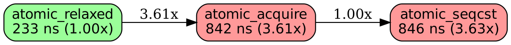

## atomic_ordering_cost/atomic_ordering_cost_n16384 on macos-aarch64-c8-bare-apple

Run `20261116T124655Z-07a9e9a3`.

| variant | median | vs best |
|---|---|---|
| atomic_relaxed | 4.35 us | 1.00x |
| atomic_seqcst | 14.28 us | 3.29x |
| atomic_acquire | 14.30 us | 3.29x |

## atomic_ordering_cost/atomic_ordering_cost_n256 on macos-aarch64-c8-bare-apple

Run `20261116T124655Z-07a9e9a3`.

| variant | median | vs best |
|---|---|---|
| atomic_relaxed | 36 ns | 1.00x |
| atomic_acquire | 165 ns | 4.61x |
| atomic_seqcst | 169 ns | 4.73x |

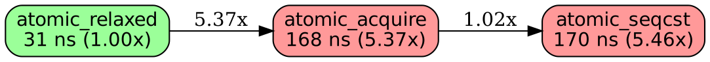

## atomic_ordering_cost/atomic_ordering_cost_n4096 on macos-aarch64-c8-bare-apple

Run `20261116T124655Z-07a9e9a3`.

| variant | median | vs best |
|---|---|---|
| atomic_relaxed | 1.05 us | 1.00x |
| atomic_acquire | 3.53 us | 3.35x |
| atomic_seqcst | 3.53 us | 3.36x |

## atomic_ordering_cost/atomic_ordering_cost_n64 on macos-aarch64-c8-bare-apple

Run `20261116T124655Z-07a9e9a3`.

| variant | median | vs best |
|---|---|---|
| atomic_relaxed | 4 ns | 1.00x |
| atomic_seqcst | 4 ns | 1.08x |
| atomic_acquire | 7 ns | 1.92x |

## atomic_vs_plain/atomic_vs_plain_n1024 on linux-x86_64-c16-bare-intel

Run `20261115T021656Z-266650fb`.

| variant | median | vs best |
|---|---|---|
| acc_plain | 1.15 us | 1.00x |

## atomic_vs_plain/atomic_vs_plain_n1024 on macos-aarch64-c8-bare-apple

Run `20261116T124746Z-07a9e9a3`.

| variant | median | vs best |
|---|---|---|
| acc_atomic_relaxed | 1.24 us | 1.00x |
| acc_plain | 1.25 us | 1.01x |
| acc_atomic_seqcst | 1.25 us | 1.01x |

## atomic_vs_plain/atomic_vs_plain_n16384 on linux-x86_64-c16-bare-intel

Run `20261115T022201Z-266650fb-dirty`.

| variant | median | vs best |
|---|---|---|
| acc_plain | 18.27 us | 1.00x |
| acc_atomic_seqcst | 18.27 us | 1.00x |
| acc_atomic_relaxed | 18.27 us | 1.00x |

## atomic_vs_plain/atomic_vs_plain_n16384 on macos-aarch64-c8-bare-apple

Run `20261116T124746Z-07a9e9a3`.

| variant | median | vs best |
|---|---|---|
| acc_plain | 20.41 us | 1.00x |
| acc_atomic_relaxed | 20.41 us | 1.00x |
| acc_atomic_seqcst | 20.41 us | 1.00x |

## atomic_vs_plain/atomic_vs_plain_n256 on linux-x86_64-c16-bare-intel

Run `20261115T021420Z-266650fb-dirty`.

| variant | median | vs best |
|---|---|---|
| acc_atomic_seqcst | 292 ns | 1.00x |
| acc_atomic_relaxed | 292 ns | 1.00x |
| acc_plain | 292 ns | 1.00x |

## atomic_vs_plain/atomic_vs_plain_n256 on macos-aarch64-c8-bare-apple

Run `20261116T124746Z-07a9e9a3`.

| variant | median | vs best |
|---|---|---|
| acc_atomic_relaxed | 272 ns | 1.00x |
| acc_atomic_seqcst | 272 ns | 1.00x |
| acc_plain | 273 ns | 1.00x |

## atomic_vs_plain/atomic_vs_plain_n4096 on linux-x86_64-c16-bare-intel

Run `20261115T021927Z-266650fb-dirty`.

| variant | median | vs best |
|---|---|---|
| acc_plain | 4.57 us | 1.00x |
| acc_atomic_relaxed | 4.57 us | 1.00x |
| acc_atomic_seqcst | 4.57 us | 1.00x |

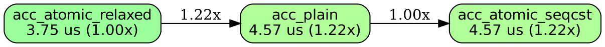

## atomic_vs_plain/atomic_vs_plain_n4096 on macos-aarch64-c8-bare-apple

Run `20261116T124746Z-07a9e9a3`.

| variant | median | vs best |
|---|---|---|
| acc_plain | 5.06 us | 1.00x |
| acc_atomic_relaxed | 5.06 us | 1.00x |
| acc_atomic_seqcst | 5.07 us | 1.00x |

## bit_count_ops/bit_count_ops_n1024 on linux-x86_64-c16-bare-intel

Run `20261115T022738Z-266650fb-dirty`.

| variant | median | vs best |
|---|---|---|
| ctz_debruijn | 52 ns | 1.00x |
| ctz_intrinsic | 52 ns | 1.00x |
| ctz_loop | 124 ns | 2.39x |

## bit_count_ops/bit_count_ops_n1024 on macos-aarch64-c8-bare-apple

Run `20261116T124835Z-07a9e9a3`.

| variant | median | vs best |
|---|---|---|
| ctz_intrinsic | 60 ns | 1.00x |
| ctz_debruijn | 60 ns | 1.00x |
| ctz_loop | 148 ns | 2.49x |

## bit_count_ops/bit_count_ops_n16384 on linux-x86_64-c16-bare-intel

Run `20261115T023242Z-266650fb-dirty`.

| variant | median | vs best |
|---|---|---|
| ctz_intrinsic | 620 ns | 1.00x |
| ctz_debruijn | 621 ns | 1.00x |
| ctz_loop | 2.47 us | 3.99x |

## bit_count_ops/bit_count_ops_n16384 on macos-aarch64-c8-bare-apple

Run `20261116T124835Z-07a9e9a3`.

| variant | median | vs best |
|---|---|---|
| ctz_intrinsic | 498 ns | 1.00x |
| ctz_debruijn | 499 ns | 1.00x |
| ctz_loop | 2.03 us | 4.07x |

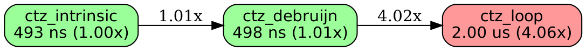

## bit_count_ops/bit_count_ops_n256 on linux-x86_64-c16-bare-intel

Run `20261115T022503Z-266650fb-dirty`.

| variant | median | vs best |
|---|---|---|
| ctz_intrinsic | 16 ns | 1.00x |
| ctz_debruijn | 20 ns | 1.21x |
| ctz_loop | 38 ns | 2.28x |

## bit_count_ops/bit_count_ops_n256 on macos-aarch64-c8-bare-apple

Run `20261116T124835Z-07a9e9a3`.

| variant | median | vs best |
|---|---|---|
| ctz_intrinsic | 23 ns | 1.00x |
| ctz_debruijn | 23 ns | 1.02x |
| ctz_loop | 51 ns | 2.21x |

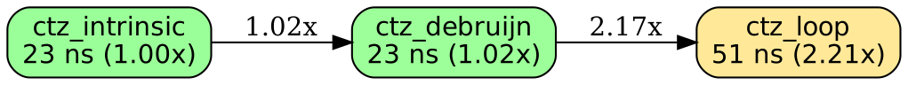

## bit_count_ops/bit_count_ops_n4096 on linux-x86_64-c16-bare-intel

Run `20261115T023010Z-266650fb-dirty`.

| variant | median | vs best |
|---|---|---|
| ctz_debruijn | 180 ns | 1.00x |
| ctz_intrinsic | 180 ns | 1.00x |
| ctz_loop | 671 ns | 3.73x |

## bit_count_ops/bit_count_ops_n4096 on macos-aarch64-c8-bare-apple

Run `20261116T124835Z-07a9e9a3`.

| variant | median | vs best |
|---|---|---|
| ctz_debruijn | 152 ns | 1.00x |
| ctz_intrinsic | 152 ns | 1.00x |
| ctz_loop | 522 ns | 3.43x |

## bounds_check/bounds_check_n1024 on linux-x86_64-c16-bare-intel

Run `20261115T023819Z-266650fb-dirty`.

| variant | median | vs best |
|---|---|---|
| bc_iter | 152 ns | 1.00x |
| bc_index | 152 ns | 1.00x |
| bc_unchecked | 153 ns | 1.00x |

## bounds_check/bounds_check_n1024 on macos-aarch64-c8-bare-apple

Run `20261116T124921Z-07a9e9a3`.

| variant | median | vs best |
|---|---|---|
| bc_index | 36 ns | 1.00x |
| bc_iter | 36 ns | 1.01x |
| bc_unchecked | 38 ns | 1.06x |

## bounds_check/bounds_check_n16384 on linux-x86_64-c16-bare-intel

Run `20261115T024323Z-266650fb-dirty`.

| variant | median | vs best |
|---|---|---|
| bc_unchecked | 2.29 us | 1.00x |
| bc_index | 2.29 us | 1.00x |
| bc_iter | 2.29 us | 1.00x |

## bounds_check/bounds_check_n16384 on macos-aarch64-c8-bare-apple

Run `20261116T124921Z-07a9e9a3`.

| variant | median | vs best |
|---|---|---|
| bc_index | 352 ns | 1.00x |
| bc_iter | 353 ns | 1.00x |
| bc_unchecked | 627 ns | 1.78x |

## bounds_check/bounds_check_n256 on linux-x86_64-c16-bare-intel

Run `20261115T023548Z-266650fb`.

| variant | median | vs best |
|---|---|---|
| bc_unchecked | 37 ns | 1.00x |

## bounds_check/bounds_check_n256 on macos-aarch64-c8-bare-apple

Run `20261116T124921Z-07a9e9a3`.

| variant | median | vs best |
|---|---|---|
| bc_index | 5 ns | 1.00x |
| bc_iter | 5 ns | 1.09x |
| bc_unchecked | 5 ns | 1.09x |

## bounds_check/bounds_check_n4096 on linux-x86_64-c16-bare-intel

Run `20261115T024051Z-266650fb-dirty`.

| variant | median | vs best |
|---|---|---|
| bc_unchecked | 580 ns | 1.00x |
| bc_index | 580 ns | 1.00x |
| bc_iter | 580 ns | 1.00x |

## bounds_check/bounds_check_n4096 on macos-aarch64-c8-bare-apple

Run `20261116T124921Z-07a9e9a3`.

| variant | median | vs best |
|---|---|---|
| bc_index | 92 ns | 1.00x |
| bc_iter | 92 ns | 1.00x |
| bc_unchecked | 142 ns | 1.54x |

## branch_pattern/branch_pattern_n1024 on linux-x86_64-c16-bare-intel

Run `20261115T024902Z-266650fb-dirty`.

| variant | median | vs best |
|---|---|---|
| branch_if | 861 ns | 1.00x |
| branch_cmov | 1.71 us | 1.99x |

## branch_pattern/branch_pattern_n1024 on macos-aarch64-c8-bare-apple

Run `20261116T125001Z-07a9e9a3`.

| variant | median | vs best |
|---|---|---|
| branch_if | 1.61 us | 1.00x |
| branch_cmov | 1.61 us | 1.00x |

## branch_pattern/branch_pattern_n16384 on linux-x86_64-c16-bare-intel

Run `20261115T025232Z-266650fb-dirty`.

| variant | median | vs best |
|---|---|---|
| branch_cmov | 27.44 us | 1.00x |
| branch_if | 29.93 us | 1.09x |

## branch_pattern/branch_pattern_n16384 on macos-aarch64-c8-bare-apple

Run `20261116T125001Z-07a9e9a3`.

| variant | median | vs best |
|---|---|---|
| branch_cmov | 26.06 us | 1.00x |
| branch_if | 26.07 us | 1.00x |

## branch_pattern/branch_pattern_n256 on linux-x86_64-c16-bare-intel

Run `20261115T024719Z-266650fb-dirty`.

| variant | median | vs best |
|---|---|---|
| branch_if | 221 ns | 1.00x |
| branch_cmov | 429 ns | 1.94x |

## branch_pattern/branch_pattern_n256 on macos-aarch64-c8-bare-apple

Run `20261116T125001Z-07a9e9a3`.

| variant | median | vs best |
|---|---|---|
| branch_if | 390 ns | 1.00x |
| branch_cmov | 390 ns | 1.00x |

## branch_pattern/branch_pattern_n4096 on linux-x86_64-c16-bare-intel

Run `20261115T025046Z-266650fb-dirty`.

| variant | median | vs best |
|---|---|---|
| branch_if | 3.15 us | 1.00x |
| branch_cmov | 6.29 us | 2.00x |

## branch_pattern/branch_pattern_n4096 on macos-aarch64-c8-bare-apple

Run `20261116T125001Z-07a9e9a3`.

| variant | median | vs best |
|---|---|---|
| branch_if | 6.50 us | 1.00x |
| branch_cmov | 6.50 us | 1.00x |

## branch_pattern/branch_pattern_n64 on linux-x86_64-c16-bare-intel

Run `20261115T024533Z-266650fb-dirty`.

| variant | median | vs best |
|---|---|---|
| branch_if | 63 ns | 1.00x |
| branch_cmov | 112 ns | 1.79x |

## branch_pattern/branch_pattern_n64 on macos-aarch64-c8-bare-apple

Run `20261116T125001Z-07a9e9a3`.

| variant | median | vs best |
|---|---|---|
| branch_if | 82 ns | 1.00x |
| branch_cmov | 82 ns | 1.00x |

## branch_predictability/branch_predictability_n1024 on linux-x86_64-c16-bare-intel

Run `20261115T025809Z-266650fb-dirty`.

| variant | median | vs best |
|---|---|---|
| bp_skew_high | 1.15 us | 1.00x |
| bp_balanced | 1.15 us | 1.00x |
| bp_skew_low | 1.15 us | 1.00x |

## branch_predictability/branch_predictability_n1024 on macos-aarch64-c8-bare-apple

Run `20261116T125047Z-07a9e9a3`.

| variant | median | vs best |
|---|---|---|
| bp_skew_high | 1.25 us | 1.00x |
| bp_skew_low | 1.25 us | 1.00x |
| bp_balanced | 1.25 us | 1.00x |

## branch_predictability/branch_predictability_n16384 on linux-x86_64-c16-bare-intel

Run `20261115T030315Z-266650fb-dirty`.

| variant | median | vs best |
|---|---|---|
| bp_skew_low | 18.27 us | 1.00x |
| bp_skew_high | 18.27 us | 1.00x |
| bp_balanced | 18.27 us | 1.00x |

## branch_predictability/branch_predictability_n16384 on macos-aarch64-c8-bare-apple

Run `20261116T125047Z-07a9e9a3`.

| variant | median | vs best |
|---|---|---|
| bp_balanced | 20.51 us | 1.00x |
| bp_skew_high | 20.51 us | 1.00x |
| bp_skew_low | 20.51 us | 1.00x |

## branch_predictability/branch_predictability_n256 on linux-x86_64-c16-bare-intel

Run `20261115T025534Z-266650fb-dirty`.

| variant | median | vs best |
|---|---|---|
| bp_skew_high | 292 ns | 1.00x |
| bp_balanced | 292 ns | 1.00x |
| bp_skew_low | 292 ns | 1.00x |

## branch_predictability/branch_predictability_n256 on macos-aarch64-c8-bare-apple

Run `20261116T125047Z-07a9e9a3`.

| variant | median | vs best |
|---|---|---|
| bp_skew_high | 292 ns | 1.00x |
| bp_skew_low | 292 ns | 1.00x |
| bp_balanced | 294 ns | 1.01x |

## branch_predictability/branch_predictability_n4096 on linux-x86_64-c16-bare-intel

Run `20261115T030041Z-266650fb-dirty`.

| variant | median | vs best |
|---|---|---|
| bp_skew_high | 3.75 us | 1.00x |
| bp_skew_low | 4.57 us | 1.22x |
| bp_balanced | 4.57 us | 1.22x |

## branch_predictability/branch_predictability_n4096 on macos-aarch64-c8-bare-apple

Run `20261116T125047Z-07a9e9a3`.

| variant | median | vs best |
|---|---|---|
| bp_skew_low | 5.10 us | 1.00x |
| bp_skew_high | 5.10 us | 1.00x |
| bp_balanced | 5.10 us | 1.00x |

## build-static/clean_n25 on linux-x86_64-c4-container-intel

Run `20261119T150158Z-ffb57e5a`.

| variant | median | vs best |
|---|---|---|
| llvm_non_incremental | 19350.54 ms | 1.00x |
| llvm_incremental | 21564.30 ms | 1.11x |

## build-static/clean_n97 on linux-x86_64-c4-container-intel

Run `20261119T171604Z-fe400621`.

| variant | median | vs best |
|---|---|---|
| llvm_non_incremental | 117220.40 ms | 1.00x |
| llvm_incremental | 126373.24 ms | 1.08x |

## build-static/leaf_n25 on linux-x86_64-c4-container-intel

Run `20261119T150158Z-ffb57e5a`.

| variant | median | vs best |
|---|---|---|
| llvm_incremental | 3920.36 ms | 1.00x |
| llvm_non_incremental | 5874.19 ms | 1.50x |

## build-static/leaf_n97 on linux-x86_64-c4-container-intel

Run `20261119T203124Z-4228372a`.

| variant | median | vs best |
|---|---|---|
| llvm_incremental | 4011.75 ms | 1.00x |
| llvm_non_incremental | 5821.77 ms | 1.45x |

## build-static/mid_n25 on linux-x86_64-c4-container-intel

Run `20261119T150158Z-ffb57e5a`.

| variant | median | vs best |
|---|---|---|
| llvm_incremental | 586.04 ms | 1.00x |
| llvm_non_incremental | 6084.57 ms | 10.38x |

## build-static/mid_n97 on linux-x86_64-c4-container-intel

Run `20261119T203124Z-4228372a`.

| variant | median | vs best |
|---|---|---|
| llvm_incremental | 2549.14 ms | 1.00x |
| llvm_non_incremental | 33358.81 ms | 13.09x |

## build-static/root_n25 on linux-x86_64-c4-container-intel

Run `20261119T150158Z-ffb57e5a`.

| variant | median | vs best |
|---|---|---|
| llvm_incremental | 1247.25 ms | 1.00x |
| llvm_non_incremental | 16745.89 ms | 13.43x |

## build-static/root_n97 on linux-x86_64-c4-container-intel

Run `20261119T203124Z-4228372a`.

| variant | median | vs best |
|---|---|---|
| llvm_incremental | 7182.84 ms | 1.00x |
| llvm_non_incremental | 89677.26 ms | 12.48x |

## cache_layout/cache_layout_n1024 on linux-x86_64-c16-bare-intel

Run `20261115T030857Z-266650fb-dirty`.

| variant | median | vs best |
|---|---|---|
| layout_soa | 28 ns | 1.00x |
| layout_aos | 28 ns | 1.00x |

## cache_layout/cache_layout_n1024 on macos-aarch64-c8-bare-apple

Run `20261116T125131Z-07a9e9a3`.

| variant | median | vs best |
|---|---|---|
| layout_soa | 12 ns | 1.00x |
| layout_aos | 13 ns | 1.03x |

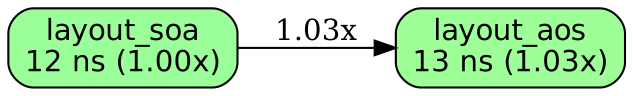

## cache_layout/cache_layout_n16384 on linux-x86_64-c16-bare-intel

Run `20261115T031223Z-266650fb-dirty`.

| variant | median | vs best |
|---|---|---|
| layout_aos | 333 ns | 1.00x |
| layout_soa | 333 ns | 1.00x |

## cache_layout/cache_layout_n16384 on macos-aarch64-c8-bare-apple

Run `20261116T125131Z-07a9e9a3`.

| variant | median | vs best |
|---|---|---|
| layout_aos | 335 ns | 1.00x |
| layout_soa | 338 ns | 1.01x |

## cache_layout/cache_layout_n256 on linux-x86_64-c16-bare-intel

Run `20261115T030714Z-266650fb-dirty`.

| variant | median | vs best |
|---|---|---|
| layout_soa | 12 ns | 1.00x |
| layout_aos | 12 ns | 1.01x |

## cache_layout/cache_layout_n256 on macos-aarch64-c8-bare-apple

Run `20261116T125131Z-07a9e9a3`.

| variant | median | vs best |
|---|---|---|
| layout_aos | 1 ns | 1.00x |
| layout_soa | 1 ns | 1.33x |

## cache_layout/cache_layout_n4096 on linux-x86_64-c16-bare-intel

Run `20261115T031040Z-266650fb-dirty`.

| variant | median | vs best |
|---|---|---|
| layout_soa | 89 ns | 1.00x |
| layout_aos | 90 ns | 1.01x |

## cache_layout/cache_layout_n4096 on macos-aarch64-c8-bare-apple

Run `20261116T125131Z-07a9e9a3`.

| variant | median | vs best |
|---|---|---|
| layout_aos | 62 ns | 1.00x |
| layout_soa | 64 ns | 1.03x |

## cache_layout/cache_layout_n64 on linux-x86_64-c16-bare-intel

Run `20261115T030527Z-266650fb-dirty`.

| variant | median | vs best |
|---|---|---|
| layout_aos | 10 ns | 1.00x |
| layout_soa | 10 ns | 1.00x |

## cache_layout/cache_layout_n64 on macos-aarch64-c8-bare-apple

Run `20261116T125131Z-07a9e9a3`.

| variant | median | vs best |
|---|---|---|
| layout_aos | 0 ns | 1.00x |
| layout_soa | 0 ns | 1.00x |

## dep_graph_csr_9/dep_graph_csr_9_n128 on linux-x86_64-c16-bare-intel

Run `20261115T032537Z-266650fb-dirty`.

| variant | median | vs best |
|---|---|---|
| dep_graph_hybrid | 734 ns | 1.00x |
| dep_graph_csr | 746 ns | 1.02x |
| dep_graph_dense | 23.42 us | 31.93x |

## dep_graph_csr_9/dep_graph_csr_9_n128 on macos-aarch64-c8-bare-apple

Run `20261116T125214Z-07a9e9a3`.

| variant | median | vs best |
|---|---|---|
| dep_graph_hybrid | 753 ns | 1.00x |
| dep_graph_csr | 778 ns | 1.03x |
| dep_graph_dense | 26.46 us | 35.12x |

## dep_graph_csr_9/dep_graph_csr_9_n16 on linux-x86_64-c16-bare-intel

Run `20261115T031800Z-266650fb-dirty`.

| variant | median | vs best |
|---|---|---|
| dep_graph_csr | 89 ns | 1.00x |
| dep_graph_dense | 439 ns | 4.93x |
| dep_graph_hybrid | 447 ns | 5.02x |

## dep_graph_csr_9/dep_graph_csr_9_n16 on macos-aarch64-c8-bare-apple

Run `20261116T125214Z-07a9e9a3`.

| variant | median | vs best |
|---|---|---|
| dep_graph_csr | 51 ns | 1.00x |
| dep_graph_hybrid | 431 ns | 8.45x |
| dep_graph_dense | 857 ns | 16.81x |

## dep_graph_csr_9/dep_graph_csr_9_n256 on linux-x86_64-c16-bare-intel

Run `20261115T032812Z-266650fb-dirty`.

| variant | median | vs best |
|---|---|---|
| dep_graph_hybrid | 1.46 us | 1.00x |
| dep_graph_csr | 1.49 us | 1.02x |
| dep_graph_dense | 92.67 us | 63.39x |

## dep_graph_csr_9/dep_graph_csr_9_n256 on macos-aarch64-c8-bare-apple

Run `20261116T125214Z-07a9e9a3`.

| variant | median | vs best |
|---|---|---|
| dep_graph_hybrid | 1.57 us | 1.00x |
| dep_graph_csr | 1.63 us | 1.03x |
| dep_graph_dense | 103.92 us | 66.08x |

## dep_graph_csr_9/dep_graph_csr_9_n32 on linux-x86_64-c16-bare-intel

Run `20261115T032032Z-266650fb-dirty`.

| variant | median | vs best |
|---|---|---|
| dep_graph_csr | 193 ns | 1.00x |
| dep_graph_hybrid | 208 ns | 1.08x |
| dep_graph_dense | 1.60 us | 8.29x |

## dep_graph_csr_9/dep_graph_csr_9_n32 on macos-aarch64-c8-bare-apple

Run `20261116T125214Z-07a9e9a3`.

| variant | median | vs best |
|---|---|---|
| dep_graph_csr | 149 ns | 1.00x |
| dep_graph_hybrid | 153 ns | 1.03x |
| dep_graph_dense | 2.12 us | 14.22x |

## dep_graph_csr_9/dep_graph_csr_9_n64 on linux-x86_64-c16-bare-intel

Run `20261115T032304Z-266650fb-dirty`.

| variant | median | vs best |
|---|---|---|
| dep_graph_csr | 377 ns | 1.00x |
| dep_graph_hybrid | 404 ns | 1.07x |
| dep_graph_dense | 6.02 us | 15.96x |

## dep_graph_csr_9/dep_graph_csr_9_n64 on macos-aarch64-c8-bare-apple

Run `20261116T125214Z-07a9e9a3`.

| variant | median | vs best |
|---|---|---|
| dep_graph_csr | 356 ns | 1.00x |
| dep_graph_hybrid | 368 ns | 1.04x |
| dep_graph_dense | 7.01 us | 19.70x |

## dep_graph_csr_9/dep_graph_csr_9_n8 on linux-x86_64-c16-bare-intel

Run `20261115T031525Z-266650fb-dirty`.

| variant | median | vs best |
|---|---|---|
| dep_graph_csr | 43 ns | 1.00x |
| dep_graph_dense | 124 ns | 2.88x |
| dep_graph_hybrid | 125 ns | 2.89x |

## dep_graph_csr_9/dep_graph_csr_9_n8 on macos-aarch64-c8-bare-apple

Run `20261116T125214Z-07a9e9a3`.

| variant | median | vs best |
|---|---|---|
| dep_graph_csr | 25 ns | 1.00x |
| dep_graph_hybrid | 101 ns | 4.11x |
| dep_graph_dense | 546 ns | 22.18x |

## dispatch_dynamic/dispatch_dynamic_n1024 on linux-x86_64-c16-bare-intel

Run `20261115T033621Z-266650fb-dirty`.

| variant | median | vs best |
|---|---|---|
| dispatch_direct | 150 ns | 1.00x |
| dispatch_volatile | 182 ns | 1.22x |
| dispatch_runtime | 193 ns | 1.29x |

## dispatch_dynamic/dispatch_dynamic_n1024 on macos-aarch64-c8-bare-apple

Run `20261116T125311Z-07a9e9a3`.

| variant | median | vs best |
|---|---|---|
| dispatch_direct | 110 ns | 1.00x |
| dispatch_volatile | 157 ns | 1.43x |
| dispatch_runtime | 287 ns | 2.61x |

## dispatch_dynamic/dispatch_dynamic_n16384 on linux-x86_64-c16-bare-intel

Run `20261115T034125Z-266650fb-dirty`.

| variant | median | vs best |
|---|---|---|
| dispatch_direct | 2.29 us | 1.00x |
| dispatch_volatile | 2.85 us | 1.25x |
| dispatch_runtime | 11.44 us | 5.00x |

## dispatch_dynamic/dispatch_dynamic_n16384 on macos-aarch64-c8-bare-apple

Run `20261116T125311Z-07a9e9a3`.

| variant | median | vs best |
|---|---|---|
| dispatch_direct | 2.51 us | 1.00x |
| dispatch_volatile | 2.56 us | 1.02x |
| dispatch_runtime | 10.74 us | 4.28x |

## dispatch_dynamic/dispatch_dynamic_n256 on linux-x86_64-c16-bare-intel

Run `20261115T033349Z-266650fb-dirty`.

| variant | median | vs best |
|---|---|---|
| dispatch_runtime | 41 ns | 1.00x |
| dispatch_direct | 43 ns | 1.05x |
| dispatch_volatile | 46 ns | 1.13x |

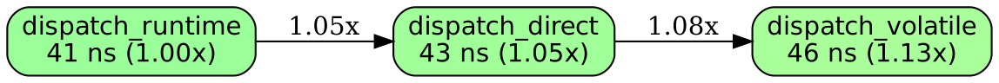

## dispatch_dynamic/dispatch_dynamic_n256 on macos-aarch64-c8-bare-apple

Run `20261116T125311Z-07a9e9a3`.

| variant | median | vs best |
|---|---|---|
| dispatch_direct | 15 ns | 1.00x |
| dispatch_volatile | 42 ns | 2.88x |
| dispatch_runtime | 42 ns | 2.91x |

## dispatch_dynamic/dispatch_dynamic_n4096 on linux-x86_64-c16-bare-intel

Run `20261115T033853Z-266650fb-dirty`.

| variant | median | vs best |
|---|---|---|
| dispatch_direct | 578 ns | 1.00x |
| dispatch_volatile | 718 ns | 1.24x |
| dispatch_runtime | 741 ns | 1.28x |

## dispatch_dynamic/dispatch_dynamic_n4096 on macos-aarch64-c8-bare-apple

Run `20261116T125311Z-07a9e9a3`.

| variant | median | vs best |
|---|---|---|
| dispatch_direct | 591 ns | 1.00x |
| dispatch_volatile | 637 ns | 1.08x |
| dispatch_runtime | 1.10 us | 1.86x |

## dispatch_dynamic/dispatch_dynamic_n64 on linux-x86_64-c16-bare-intel

Run `20261115T033114Z-266650fb-dirty`.

| variant | median | vs best |
|---|---|---|
| dispatch_runtime | 16 ns | 1.00x |
| dispatch_direct | 16 ns | 1.02x |
| dispatch_volatile | 16 ns | 1.03x |

## dispatch_dynamic/dispatch_dynamic_n64 on macos-aarch64-c8-bare-apple

Run `20261116T125311Z-07a9e9a3`.

| variant | median | vs best |
|---|---|---|
| dispatch_direct | 2 ns | 1.00x |
| dispatch_volatile | 7 ns | 3.94x |
| dispatch_runtime | 8 ns | 4.88x |

## dispatch_static/dispatch_static_n1024 on linux-x86_64-c16-bare-intel

Run `20261115T034930Z-266650fb-dirty`.

| variant | median | vs best |
|---|---|---|
| dispatch_const_ptr | 150 ns | 1.00x |
| dispatch_direct | 150 ns | 1.00x |
| dispatch_trait | 150 ns | 1.00x |

## dispatch_static/dispatch_static_n1024 on macos-aarch64-c8-bare-apple

Run `20261116T125400Z-07a9e9a3`.

| variant | median | vs best |
|---|---|---|
| dispatch_const_ptr | 110 ns | 1.00x |
| dispatch_direct | 110 ns | 1.00x |
| dispatch_trait | 110 ns | 1.00x |

## dispatch_static/dispatch_static_n16384 on linux-x86_64-c16-bare-intel

Run `20261115T035434Z-266650fb-dirty`.

| variant | median | vs best |
|---|---|---|
| dispatch_direct | 2.29 us | 1.00x |
| dispatch_trait | 2.29 us | 1.00x |
| dispatch_const_ptr | 2.29 us | 1.00x |

## dispatch_static/dispatch_static_n16384 on macos-aarch64-c8-bare-apple

Run `20261116T125400Z-07a9e9a3`.

| variant | median | vs best |
|---|---|---|
| dispatch_const_ptr | 2.51 us | 1.00x |
| dispatch_direct | 2.51 us | 1.00x |
| dispatch_trait | 2.51 us | 1.00x |

## dispatch_static/dispatch_static_n256 on linux-x86_64-c16-bare-intel

Run `20261115T034658Z-266650fb-dirty`.

| variant | median | vs best |
|---|---|---|
| dispatch_const_ptr | 43 ns | 1.00x |
| dispatch_direct | 43 ns | 1.00x |
| dispatch_trait | 43 ns | 1.00x |

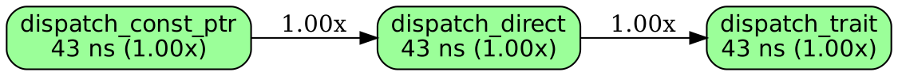

## dispatch_static/dispatch_static_n256 on macos-aarch64-c8-bare-apple

Run `20261116T125400Z-07a9e9a3`.

| variant | median | vs best |
|---|---|---|
| dispatch_const_ptr | 14 ns | 1.00x |
| dispatch_direct | 14 ns | 1.00x |
| dispatch_trait | 15 ns | 1.03x |

## dispatch_static/dispatch_static_n4096 on linux-x86_64-c16-bare-intel

Run `20261115T035202Z-266650fb-dirty`.

| variant | median | vs best |
|---|---|---|
| dispatch_const_ptr | 578 ns | 1.00x |
| dispatch_direct | 578 ns | 1.00x |
| dispatch_trait | 578 ns | 1.00x |

## dispatch_static/dispatch_static_n4096 on macos-aarch64-c8-bare-apple

Run `20261116T125400Z-07a9e9a3`.

| variant | median | vs best |
|---|---|---|
| dispatch_trait | 591 ns | 1.00x |
| dispatch_const_ptr | 592 ns | 1.00x |
| dispatch_direct | 592 ns | 1.00x |

## dispatch_static/dispatch_static_n64 on linux-x86_64-c16-bare-intel

Run `20261115T034423Z-266650fb-dirty`.

| variant | median | vs best |
|---|---|---|
| dispatch_const_ptr | 16 ns | 1.00x |
| dispatch_direct | 16 ns | 1.00x |
| dispatch_trait | 16 ns | 1.00x |

## dispatch_static/dispatch_static_n64 on macos-aarch64-c8-bare-apple

Run `20261116T125400Z-07a9e9a3`.

| variant | median | vs best |
|---|---|---|
| dispatch_trait | 2 ns | 1.00x |
| dispatch_const_ptr | 2 ns | 1.12x |
| dispatch_direct | 2 ns | 1.24x |

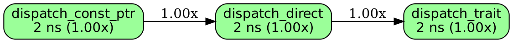

## ema_axis_h/ema_axis_h_n1024 on linux-x86_64-c16-bare-intel

Run `20261115T040242Z-266650fb-dirty`.

| variant | median | vs best |
|---|---|---|
| ema_scalar | 118 ns | 1.00x |
| ema_autovec | 196 ns | 1.66x |
| ema_neon | 197 ns | 1.67x |

## ema_axis_h/ema_axis_h_n1024 on macos-aarch64-c8-bare-apple

Run `20261116T125450Z-07a9e9a3`.

| variant | median | vs best |
|---|---|---|
| ema_neon | 40 ns | 1.00x |
| ema_scalar | 85 ns | 2.10x |
| ema_autovec | 381 ns | 9.44x |

## ema_axis_h/ema_axis_h_n16384 on linux-x86_64-c16-bare-intel

Run `20261115T040747Z-266650fb-dirty`.

| variant | median | vs best |
|---|---|---|
| ema_scalar | 1.76 us | 1.00x |
| ema_autovec | 2.93 us | 1.66x |
| ema_neon | 2.94 us | 1.67x |

## ema_axis_h/ema_axis_h_n16384 on macos-aarch64-c8-bare-apple

Run `20261116T125450Z-07a9e9a3`.

| variant | median | vs best |
|---|---|---|
| ema_neon | 1.49 us | 1.00x |
| ema_scalar | 1.57 us | 1.06x |
| ema_autovec | 6.53 us | 4.38x |

## ema_axis_h/ema_axis_h_n256 on linux-x86_64-c16-bare-intel

Run `20261115T040011Z-266650fb-dirty`.

| variant | median | vs best |
|---|---|---|
| ema_scalar | 36 ns | 1.00x |
| ema_autovec | 59 ns | 1.62x |
| ema_neon | 59 ns | 1.62x |

## ema_axis_h/ema_axis_h_n256 on macos-aarch64-c8-bare-apple

Run `20261116T125450Z-07a9e9a3`.

| variant | median | vs best |
|---|---|---|
| ema_neon | 1 ns | 1.00x |
| ema_scalar | 24 ns | 19.75x |
| ema_autovec | 76 ns | 63.17x |

## ema_axis_h/ema_axis_h_n4096 on linux-x86_64-c16-bare-intel

Run `20261115T040514Z-266650fb-dirty`.

| variant | median | vs best |
|---|---|---|
| ema_scalar | 446 ns | 1.00x |
| ema_autovec | 742 ns | 1.66x |
| ema_neon | 744 ns | 1.67x |

## ema_axis_h/ema_axis_h_n4096 on macos-aarch64-c8-bare-apple

Run `20261116T125450Z-07a9e9a3`.

| variant | median | vs best |
|---|---|---|
| ema_neon | 292 ns | 1.00x |
| ema_scalar | 377 ns | 1.29x |
| ema_autovec | 1.61 us | 5.50x |

## ema_axis_h/ema_axis_h_n64 on linux-x86_64-c16-bare-intel

Run `20261115T035736Z-266650fb-dirty`.

| variant | median | vs best |
|---|---|---|
| ema_neon | 12 ns | 1.00x |
| ema_autovec | 13 ns | 1.06x |
| ema_scalar | 15 ns | 1.20x |

## ema_axis_h/ema_axis_h_n64 on macos-aarch64-c8-bare-apple

Run `20261116T125450Z-07a9e9a3`.

| variant | median | vs best |
|---|---|---|
| ema_neon | 0 ns | 0.00x |
| ema_autovec | 0 ns | 400000000.00x |
| ema_scalar | 2 ns | 2500000000.00x |

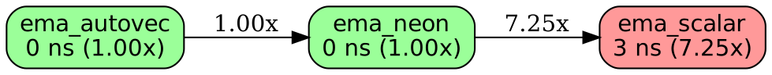

## ema_formulation/ema_formulation_n1024 on linux-x86_64-c16-bare-intel

Run `20261115T041327Z-266650fb-dirty`.

| variant | median | vs best |
|---|---|---|
| ema_form_intshift | 863 ns | 1.00x |
| ema_form_q32 | 1.43 us | 1.66x |
| ema_form_float | 2.00 us | 2.32x |

## ema_formulation/ema_formulation_n1024 on macos-aarch64-c8-bare-apple

Run `20261116T125539Z-07a9e9a3`.

| variant | median | vs best |
|---|---|---|
| ema_form_intshift | 1.22 us | 1.00x |
| ema_form_q32 | 1.85 us | 1.52x |
| ema_form_float | 2.09 us | 1.71x |

## ema_formulation/ema_formulation_n16384 on linux-x86_64-c16-bare-intel

Run `20261115T041834Z-266650fb-dirty`.

| variant | median | vs best |
|---|---|---|
| ema_form_intshift | 13.70 us | 1.00x |
| ema_form_q32 | 22.83 us | 1.67x |
| ema_form_float | 31.96 us | 2.33x |

## ema_formulation/ema_formulation_n16384 on macos-aarch64-c8-bare-apple

Run `20261116T125539Z-07a9e9a3`.

| variant | median | vs best |
|---|---|---|
| ema_form_intshift | 20.40 us | 1.00x |
| ema_form_q32 | 30.64 us | 1.50x |
| ema_form_float | 35.68 us | 1.75x |

## ema_formulation/ema_formulation_n256 on linux-x86_64-c16-bare-intel

Run `20261115T041052Z-266650fb-dirty`.

| variant | median | vs best |
|---|---|---|
| ema_form_intshift | 222 ns | 1.00x |
| ema_form_q32 | 363 ns | 1.64x |
| ema_form_float | 509 ns | 2.29x |

## ema_formulation/ema_formulation_n256 on macos-aarch64-c8-bare-apple

Run `20261116T125539Z-07a9e9a3`.

| variant | median | vs best |
|---|---|---|
| ema_form_intshift | 262 ns | 1.00x |
| ema_form_float | 410 ns | 1.57x |
| ema_form_q32 | 416 ns | 1.59x |

## ema_formulation/ema_formulation_n4096 on linux-x86_64-c16-bare-intel

Run `20261115T041559Z-266650fb-dirty`.

| variant | median | vs best |
|---|---|---|
| ema_form_intshift | 3.43 us | 1.00x |
| ema_form_q32 | 5.72 us | 1.67x |
| ema_form_float | 8.00 us | 2.33x |

## ema_formulation/ema_formulation_n4096 on macos-aarch64-c8-bare-apple

Run `20261116T125539Z-07a9e9a3`.

| variant | median | vs best |
|---|---|---|
| ema_form_intshift | 5.06 us | 1.00x |
| ema_form_q32 | 7.61 us | 1.50x |
| ema_form_float | 8.80 us | 1.74x |

## engine_vs_std/accumulator_n1048576 on macos-aarch64-c8-bare-apple

Run `20261116T125720Z-07a9e9a3`.

| variant | median | vs best |
|---|---|---|
| evs_std_par | 91.32 us | 1.00x |
| evs_std | 105.30 us | 1.15x |
| evs_engine_par | 230.49 us | 2.52x |
| evs_engine | 732.42 us | 8.02x |

## engine_vs_std/accumulator_n4096 on macos-aarch64-c8-bare-apple

Run `20261116T125720Z-07a9e9a3`.

| variant | median | vs best |
|---|---|---|
| evs_std | 412 ns | 1.00x |
| evs_engine | 13.00 us | 31.53x |
| evs_std_par | 22.36 us | 54.21x |
| evs_engine_par | 53.30 us | 129.20x |

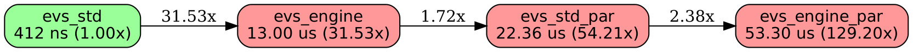

## engine_vs_std/accumulator_n4194304 on macos-aarch64-c8-bare-apple

Run `20261116T125720Z-07a9e9a3`.

| variant | median | vs best |
|---|---|---|
| evs_std_par | 528.71 us | 1.00x |
| evs_std | 589.52 us | 1.12x |
| evs_engine_par | 716.77 us | 1.36x |
| evs_engine | 2.82 ms | 5.33x |

## engine_vs_std/accumulator_n65536 on macos-aarch64-c8-bare-apple

Run `20261116T125720Z-07a9e9a3`.

| variant | median | vs best |
|---|---|---|
| evs_std | 6.47 us | 1.00x |
| evs_std_par | 36.03 us | 5.56x |
| evs_engine | 54.80 us | 8.46x |
| evs_engine_par | 68.47 us | 10.57x |

## engine_vs_std/branching_n1048576 on macos-aarch64-c8-bare-apple

Run `20261116T125720Z-07a9e9a3`.

| variant | median | vs best |
|---|---|---|
| evs_std | 125.36 us | 1.00x |
| evs_engine | 330.54 us | 2.64x |

## engine_vs_std/branching_n4096 on macos-aarch64-c8-bare-apple

Run `20261116T125720Z-07a9e9a3`.

| variant | median | vs best |
|---|---|---|
| evs_std | 488 ns | 1.00x |
| evs_engine | 11.26 us | 23.10x |

## engine_vs_std/branching_n4194304 on macos-aarch64-c8-bare-apple

Run `20261116T125720Z-07a9e9a3`.

| variant | median | vs best |
|---|---|---|
| evs_std | 581.93 us | 1.00x |
| evs_engine | 1.97 ms | 3.39x |

## engine_vs_std/branching_n65536 on macos-aarch64-c8-bare-apple

Run `20261116T125720Z-07a9e9a3`.

| variant | median | vs best |
|---|---|---|
| evs_std | 7.75 us | 1.00x |
| evs_engine | 28.03 us | 3.62x |

## engine_vs_std/element_wise_n1048576 on macos-aarch64-c8-bare-apple

Run `20261116T125720Z-07a9e9a3`.

| variant | median | vs best |
|---|---|---|
| evs_std | 105.75 us | 1.00x |
| evs_engine | 107.84 us | 1.02x |

## engine_vs_std/element_wise_n4096 on macos-aarch64-c8-bare-apple

Run `20261116T125720Z-07a9e9a3`.

| variant | median | vs best |
|---|---|---|
| evs_std | 408 ns | 1.00x |
| evs_engine | 458 ns | 1.12x |

## engine_vs_std/element_wise_n4194304 on macos-aarch64-c8-bare-apple

Run `20261116T125720Z-07a9e9a3`.

| variant | median | vs best |
|---|---|---|
| evs_std | 573.05 us | 1.00x |
| evs_engine | 577.82 us | 1.01x |

## engine_vs_std/element_wise_n65536 on macos-aarch64-c8-bare-apple

Run `20261116T125720Z-07a9e9a3`.

| variant | median | vs best |
|---|---|---|
| evs_std | 6.47 us | 1.00x |
| evs_engine | 6.65 us | 1.03x |

## engine_vs_std/startup_accumulator_n4194304 on macos-aarch64-c8-bare-apple

Run `20261116T125720Z-07a9e9a3`.

| variant | median | vs best |
|---|---|---|
| evs_engine_startup | 276.48 us | 1.00x |
| evs_std_startup | 400.50 us | 1.45x |

## engine_vs_std/startup_branching_n4194304 on macos-aarch64-c8-bare-apple

Run `20261116T125720Z-07a9e9a3`.

| variant | median | vs best |
|---|---|---|
| evs_std_startup | 406.61 us | 1.00x |
| evs_engine_startup | 1.05 ms | 2.58x |

## engine_vs_std/startup_element_wise_n4194304 on macos-aarch64-c8-bare-apple

Run `20261116T125720Z-07a9e9a3`.

| variant | median | vs best |
|---|---|---|
| evs_std_startup | 404.01 us | 1.00x |
| evs_engine_startup | 1.34 ms | 3.31x |

## engine_vs_std/startup_wide_parallel_n4194304 on macos-aarch64-c8-bare-apple

Run `20261116T125720Z-07a9e9a3`.

| variant | median | vs best |
|---|---|---|
| evs_std_startup | 1.92 ms | 1.00x |
| evs_engine_startup | 2.09 ms | 1.09x |

## engine_vs_std/wide_parallel_n1048576 on macos-aarch64-c8-bare-apple

Run `20261116T125720Z-07a9e9a3`.

| variant | median | vs best |
|---|---|---|
| evs_std_par | 862.24 us | 1.00x |
| evs_engine_par | 880.45 us | 1.02x |
| evs_std | 2.95 ms | 3.42x |
| evs_engine | 2.96 ms | 3.43x |

## engine_vs_std/wide_parallel_n4096 on macos-aarch64-c8-bare-apple

Run `20261116T125720Z-07a9e9a3`.

| variant | median | vs best |
|---|---|---|
| evs_std | 11.63 us | 1.00x |
| evs_engine | 22.13 us | 1.90x |
| evs_std_par | 30.94 us | 2.66x |
| evs_engine_par | 67.06 us | 5.77x |

## engine_vs_std/wide_parallel_n4194304 on macos-aarch64-c8-bare-apple

Run `20261116T125720Z-07a9e9a3`.

| variant | median | vs best |
|---|---|---|
| evs_std_par | 3.24 ms | 1.00x |
| evs_engine_par | 3.27 ms | 1.01x |
| evs_std | 11.77 ms | 3.64x |
| evs_engine | 11.80 ms | 3.65x |

## engine_vs_std/wide_parallel_n65536 on macos-aarch64-c8-bare-apple

Run `20261116T125720Z-07a9e9a3`.

| variant | median | vs best |
|---|---|---|
| evs_std_par | 104.02 us | 1.00x |
| evs_engine_par | 112.33 us | 1.08x |
| evs_std | 183.21 us | 1.76x |
| evs_engine | 194.88 us | 1.87x |

## fiber_theory/fiber_theory_n16 on linux-x86_64-c16-bare-intel

Run `20261115T042302Z-266650fb-dirty`.

| variant | median | vs best |
|---|---|---|
| fib_greedy | 95 ns | 1.00x |
| fib_spectral | 72.54 us | 761.22x |

## fiber_theory/fiber_theory_n16 on macos-aarch64-c8-bare-apple

Run `20261116T130106Z-07a9e9a3`.

| variant | median | vs best |
|---|---|---|
| fib_greedy | 92 ns | 1.00x |
| fib_spectral | 64.27 us | 700.92x |

## fiber_theory/fiber_theory_n32 on linux-x86_64-c16-bare-intel

Run `20261115T042449Z-266650fb-dirty`.

| variant | median | vs best |
|---|---|---|
| fib_greedy | 191 ns | 1.00x |
| fib_spectral | 86.81 us | 455.22x |

## fiber_theory/fiber_theory_n32 on macos-aarch64-c8-bare-apple

Run `20261116T130106Z-07a9e9a3`.

| variant | median | vs best |
|---|---|---|
| fib_greedy | 182 ns | 1.00x |
| fib_spectral | 79.89 us | 437.73x |

## fiber_theory/fiber_theory_n64 on linux-x86_64-c16-bare-intel

Run `20261115T042637Z-266650fb-dirty`.

| variant | median | vs best |
|---|---|---|
| fib_greedy | 401 ns | 1.00x |
| fib_spectral | 113.57 us | 282.93x |

## fiber_theory/fiber_theory_n64 on macos-aarch64-c8-bare-apple

Run `20261116T130106Z-07a9e9a3`.

| variant | median | vs best |
|---|---|---|
| fib_greedy | 379 ns | 1.00x |
| fib_spectral | 124.21 us | 327.39x |

## fiber_theory/fiber_theory_n8 on linux-x86_64-c16-bare-intel

Run `20261115T042113Z-266650fb-dirty`.

| variant | median | vs best |
|---|---|---|
| fib_greedy | 50 ns | 1.00x |
| fib_spectral | 16.08 us | 320.29x |

## fiber_theory/fiber_theory_n8 on macos-aarch64-c8-bare-apple

Run `20261116T130106Z-07a9e9a3`.

| variant | median | vs best |
|---|---|---|
| fib_greedy | 35 ns | 1.00x |
| fib_spectral | 16.47 us | 476.00x |

## float_width/float_width_n1024 on linux-x86_64-c16-bare-intel

Run `20261115T043214Z-266650fb-dirty`.

| variant | median | vs best |
|---|---|---|
| float_i64_scaled | 578 ns | 1.00x |
| float_f64 | 2.53 us | 4.38x |
| float_f32 | 2.57 us | 4.44x |

## float_width/float_width_n1024 on macos-aarch64-c8-bare-apple

Run `20261116T130158Z-07a9e9a3`.

| variant | median | vs best |
|---|---|---|
| float_f32 | 249 ns | 1.00x |
| float_f64 | 311 ns | 1.25x |
| float_i64_scaled | 422 ns | 1.70x |

## float_width/float_width_n16384 on linux-x86_64-c16-bare-intel

Run `20261115T043721Z-266650fb-dirty`.

| variant | median | vs best |
|---|---|---|
| float_i64_scaled | 9.14 us | 1.00x |
| float_f32 | 40.51 us | 4.43x |
| float_f64 | 40.51 us | 4.43x |

## float_width/float_width_n16384 on macos-aarch64-c8-bare-apple

Run `20261116T130158Z-07a9e9a3`.

| variant | median | vs best |
|---|---|---|
| float_f32 | 5.04 us | 1.00x |
| float_f64 | 5.11 us | 1.01x |
| float_i64_scaled | 6.41 us | 1.27x |

## float_width/float_width_n256 on linux-x86_64-c16-bare-intel

Run `20261115T042939Z-266650fb-dirty`.

| variant | median | vs best |
|---|---|---|
| float_i64_scaled | 151 ns | 1.00x |
| float_f32 | 527 ns | 3.49x |
| float_f64 | 532 ns | 3.52x |

## float_width/float_width_n256 on macos-aarch64-c8-bare-apple

Run `20261116T130158Z-07a9e9a3`.

| variant | median | vs best |
|---|---|---|
| float_f32 | 45 ns | 1.00x |
| float_f64 | 73 ns | 1.61x |
| float_i64_scaled | 119 ns | 2.62x |

## float_width/float_width_n4096 on linux-x86_64-c16-bare-intel

Run `20261115T043446Z-266650fb-dirty`.

| variant | median | vs best |
|---|---|---|
| float_i64_scaled | 2.29 us | 1.00x |
| float_f32 | 10.41 us | 4.55x |
| float_f64 | 10.55 us | 4.61x |

## float_width/float_width_n4096 on macos-aarch64-c8-bare-apple

Run `20261116T130158Z-07a9e9a3`.

| variant | median | vs best |
|---|---|---|
| float_f32 | 1.21 us | 1.00x |
| float_f64 | 1.27 us | 1.05x |
| float_i64_scaled | 1.62 us | 1.34x |

## fnptr_table_dispatch/fnptr_table_dispatch_n1024 on linux-x86_64-c16-bare-intel

Run `20261115T044118Z-266650fb`.

| variant | median | vs best |
|---|---|---|
| fpt_table_16 | 178 ns | 1.00x |

## fnptr_table_dispatch/fnptr_table_dispatch_n1024 on macos-aarch64-c8-bare-apple

Run `20261116T130242Z-07a9e9a3`.

| variant | median | vs best |
|---|---|---|
| fpt_match_16 | 208 ns | 1.00x |
| fpt_table_16 | 317 ns | 1.52x |

## fnptr_table_dispatch/fnptr_table_dispatch_n16384 on linux-x86_64-c16-bare-intel

Run `20261115T044445Z-266650fb-dirty`.

| variant | median | vs best |
|---|---|---|
| fpt_match_16 | 12.99 us | 1.00x |
| fpt_table_16 | 15.12 us | 1.16x |

## fnptr_table_dispatch/fnptr_table_dispatch_n16384 on macos-aarch64-c8-bare-apple

Run `20261116T130242Z-07a9e9a3`.

| variant | median | vs best |
|---|---|---|
| fpt_match_16 | 10.97 us | 1.00x |
| fpt_table_16 | 11.75 us | 1.07x |

## fnptr_table_dispatch/fnptr_table_dispatch_n256 on linux-x86_64-c16-bare-intel

Run `20261115T043931Z-266650fb-dirty`.

| variant | median | vs best |
|---|---|---|
| fpt_table_16 | 30 ns | 1.00x |
| fpt_match_16 | 34 ns | 1.13x |

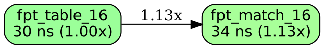

## fnptr_table_dispatch/fnptr_table_dispatch_n256 on macos-aarch64-c8-bare-apple

Run `20261116T130242Z-07a9e9a3`.

| variant | median | vs best |
|---|---|---|
| fpt_table_16 | 42 ns | 1.00x |
| fpt_match_16 | 63 ns | 1.52x |

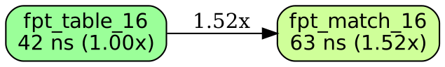

## fnptr_table_dispatch/fnptr_table_dispatch_n4096 on linux-x86_64-c16-bare-intel

Run `20261115T044301Z-266650fb-dirty`.

| variant | median | vs best |
|---|---|---|
| fpt_match_16 | 590 ns | 1.00x |
| fpt_table_16 | 1.99 us | 3.36x |

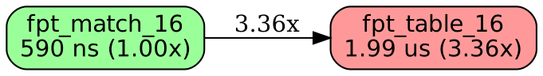

## fnptr_table_dispatch/fnptr_table_dispatch_n4096 on macos-aarch64-c8-bare-apple

Run `20261116T130242Z-07a9e9a3`.

| variant | median | vs best |
|---|---|---|
| fpt_match_16 | 787 ns | 1.00x |
| fpt_table_16 | 1.24 us | 1.58x |

## fold_strategy/fold_strategy_n1024 on linux-x86_64-c16-bare-intel

Run `20261115T045022Z-266650fb-dirty`.

| variant | median | vs best |
|---|---|---|
| fold_quad | 45 ns | 1.00x |
| fold_paired | 79 ns | 1.76x |
| fold_sequential | 150 ns | 3.31x |

## fold_strategy/fold_strategy_n1024 on macos-aarch64-c8-bare-apple

Run `20261116T130326Z-07a9e9a3`.

| variant | median | vs best |
|---|---|---|
| fold_quad | 52 ns | 1.00x |
| fold_paired | 67 ns | 1.29x |
| fold_sequential | 106 ns | 2.04x |

## fold_strategy/fold_strategy_n16384 on linux-x86_64-c16-bare-intel

Run `20261115T045526Z-266650fb-dirty`.

| variant | median | vs best |
|---|---|---|
| fold_quad | 580 ns | 1.00x |
| fold_paired | 1.15 us | 1.98x |
| fold_sequential | 2.29 us | 3.94x |

## fold_strategy/fold_strategy_n16384 on macos-aarch64-c8-bare-apple

Run `20261116T130326Z-07a9e9a3`.

| variant | median | vs best |
|---|---|---|
| fold_quad | 658 ns | 1.00x |
| fold_paired | 1.27 us | 1.93x |
| fold_sequential | 2.51 us | 3.81x |

## fold_strategy/fold_strategy_n256 on linux-x86_64-c16-bare-intel

Run `20261115T044747Z-266650fb-dirty`.

| variant | median | vs best |
|---|---|---|
| fold_quad | 21 ns | 1.00x |
| fold_paired | 26 ns | 1.23x |
| fold_sequential | 43 ns | 2.03x |

## fold_strategy/fold_strategy_n256 on macos-aarch64-c8-bare-apple

Run `20261116T130326Z-07a9e9a3`.

| variant | median | vs best |
|---|---|---|
| fold_sequential | 15 ns | 1.00x |
| fold_paired | 15 ns | 1.01x |
| fold_quad | 15 ns | 1.03x |

## fold_strategy/fold_strategy_n4096 on linux-x86_64-c16-bare-intel

Run `20261115T045253Z-266650fb-dirty`.

| variant | median | vs best |
|---|---|---|
| fold_quad | 152 ns | 1.00x |
| fold_paired | 294 ns | 1.93x |
| fold_sequential | 578 ns | 3.79x |

## fold_strategy/fold_strategy_n4096 on macos-aarch64-c8-bare-apple

Run `20261116T130326Z-07a9e9a3`.

| variant | median | vs best |
|---|---|---|
| fold_quad | 176 ns | 1.00x |
| fold_paired | 310 ns | 1.77x |
| fold_sequential | 589 ns | 3.36x |

## frame_wide/heavy_n1048576 on macos-aarch64-c8-bare-apple

Run `20261116T130625Z-07a9e9a3`.

| variant | median | vs best |
|---|---|---|
| rust_std_par | 2.56 ms | 1.00x |
| hand_par | 3.11 ms | 1.22x |
| engine_par | 7.96 ms | 3.11x |
| rust_nostd | 9.30 ms | 3.64x |
| engine | 9.37 ms | 3.67x |
| rust_std | 9.40 ms | 3.68x |
| hand | 13.39 ms | 5.24x |

## frame_wide/heavy_n16777216 on macos-aarch64-c8-bare-apple

Run `20261116T130625Z-07a9e9a3`.

| variant | median | vs best |
|---|---|---|
| rust_std_par | 42.32 ms | 1.00x |
| hand_par | 47.54 ms | 1.12x |
| engine_par | 127.28 ms | 3.01x |
| rust_nostd | 150.77 ms | 3.56x |
| engine | 150.96 ms | 3.57x |
| rust_std | 151.63 ms | 3.58x |
| hand | 213.92 ms | 5.06x |

## frame_wide/heavy_n4194304 on macos-aarch64-c8-bare-apple

Run `20261116T130625Z-07a9e9a3`.

| variant | median | vs best |
|---|---|---|
| rust_std_par | 11.02 ms | 1.00x |
| hand_par | 12.40 ms | 1.13x |
| engine_par | 31.52 ms | 2.86x |
| rust_nostd | 37.11 ms | 3.37x |
| rust_std | 37.33 ms | 3.39x |
| engine | 37.42 ms | 3.39x |
| hand | 53.45 ms | 4.85x |

## frame_wide/heavy_n65536 on macos-aarch64-c8-bare-apple

Run `20261116T130625Z-07a9e9a3`.

| variant | median | vs best |
|---|---|---|
| rust_std_par | 211.72 us | 1.00x |
| hand_par | 246.15 us | 1.16x |
| engine_par | 538.42 us | 2.54x |
| rust_nostd | 576.53 us | 2.72x |
| rust_std | 585.00 us | 2.76x |
| engine | 590.79 us | 2.79x |
| hand | 833.85 us | 3.94x |

## frame_wide/light_n1048576 on macos-aarch64-c8-bare-apple

Run `20261116T130625Z-07a9e9a3`.

| variant | median | vs best |
|---|---|---|
| hand_par | 209.05 us | 1.00x |
| hand | 262.52 us | 1.26x |
| rust_std_par | 1.25 ms | 5.96x |
| rust_std | 1.47 ms | 7.01x |
| rust_nostd | 1.70 ms | 8.11x |
| engine | 1.84 ms | 8.78x |
| engine_par | 1.85 ms | 8.86x |

## frame_wide/light_n16777216 on macos-aarch64-c8-bare-apple

Run `20261116T130625Z-07a9e9a3`.

| variant | median | vs best |
|---|---|---|
| hand | 7.81 ms | 1.00x |
| hand_par | 8.14 ms | 1.04x |
| rust_std | 29.61 ms | 3.79x |
| rust_nostd | 29.73 ms | 3.81x |
| engine_par | 31.82 ms | 4.07x |
| engine | 33.59 ms | 4.30x |
| rust_std_par | 44.04 ms | 5.64x |

## frame_wide/light_n4194304 on macos-aarch64-c8-bare-apple

Run `20261116T130625Z-07a9e9a3`.

| variant | median | vs best |
|---|---|---|
| hand_par | 1.83 ms | 1.00x |
| hand | 1.84 ms | 1.00x |
| rust_nostd | 7.36 ms | 4.03x |
| rust_std | 7.38 ms | 4.04x |
| engine_par | 7.91 ms | 4.33x |
| engine | 8.26 ms | 4.52x |
| rust_std_par | 10.50 ms | 5.74x |

## frame_wide/light_n65536 on macos-aarch64-c8-bare-apple

Run `20261116T130625Z-07a9e9a3`.

| variant | median | vs best |
|---|---|---|
| hand | 15.00 us | 1.00x |
| hand_par | 43.54 us | 2.90x |
| rust_nostd | 70.08 us | 4.67x |
| rust_std | 71.32 us | 4.75x |
| engine | 78.00 us | 5.20x |
| rust_std_par | 83.35 us | 5.56x |
| engine_par | 109.97 us | 7.33x |

## fxpmul_strategy/fxpmul_strategy_n1024 on linux-x86_64-c16-bare-intel

Run `20261115T050123Z-266650fb-dirty`.

| variant | median | vs best |
|---|---|---|
| fxpmul_hot | 97 ns | 1.00x |
| fxpmul_precise | 151 ns | 1.55x |

## fxpmul_strategy/fxpmul_strategy_n1024 on macos-aarch64-c8-bare-apple

Run `20261116T132132Z-07a9e9a3`.

| variant | median | vs best |
|---|---|---|
| fxpmul_hot | 91 ns | 1.00x |
| fxpmul_precise | 107 ns | 1.17x |

## fxpmul_strategy/fxpmul_strategy_n16384 on linux-x86_64-c16-bare-intel

Run `20261115T050449Z-266650fb-dirty`.

| variant | median | vs best |
|---|---|---|
| fxpmul_hot | 1.43 us | 1.00x |
| fxpmul_precise | 2.29 us | 1.60x |

## fxpmul_strategy/fxpmul_strategy_n16384 on macos-aarch64-c8-bare-apple

Run `20261116T132132Z-07a9e9a3`.

| variant | median | vs best |
|---|---|---|
| fxpmul_hot | 1.59 us | 1.00x |
| fxpmul_precise | 1.91 us | 1.20x |

## fxpmul_strategy/fxpmul_strategy_n256 on linux-x86_64-c16-bare-intel

Run `20261115T045940Z-266650fb-dirty`.

| variant | median | vs best |
|---|---|---|
| fxpmul_hot | 30 ns | 1.00x |
| fxpmul_precise | 44 ns | 1.44x |

## fxpmul_strategy/fxpmul_strategy_n256 on macos-aarch64-c8-bare-apple

Run `20261116T132132Z-07a9e9a3`.

| variant | median | vs best |
|---|---|---|
| fxpmul_hot | 18 ns | 1.00x |
| fxpmul_precise | 25 ns | 1.41x |

## fxpmul_strategy/fxpmul_strategy_n4096 on linux-x86_64-c16-bare-intel

Run `20261115T050306Z-266650fb-dirty`.

| variant | median | vs best |
|---|---|---|
| fxpmul_hot | 364 ns | 1.00x |
| fxpmul_precise | 578 ns | 1.59x |

## fxpmul_strategy/fxpmul_strategy_n4096 on macos-aarch64-c8-bare-apple

Run `20261116T132132Z-07a9e9a3`.

| variant | median | vs best |
|---|---|---|
| fxpmul_hot | 387 ns | 1.00x |
| fxpmul_precise | 468 ns | 1.21x |

## fxpmul_strategy/fxpmul_strategy_n64 on linux-x86_64-c16-bare-intel

Run `20261115T045753Z-266650fb-dirty`.

| variant | median | vs best |
|---|---|---|
| fxpmul_hot | 14 ns | 1.00x |
| fxpmul_precise | 17 ns | 1.25x |

## fxpmul_strategy/fxpmul_strategy_n64 on macos-aarch64-c8-bare-apple

Run `20261116T132132Z-07a9e9a3`.

| variant | median | vs best |
|---|---|---|
| fxpmul_hot | 2 ns | 1.00x |
| fxpmul_precise | 3 ns | 1.16x |

## hash_algos/hash_algos_n1024 on linux-x86_64-c16-bare-intel

Run `20261115T051258Z-266650fb-dirty`.

| variant | median | vs best |
|---|---|---|
| hash_xxh | 190 ns | 1.00x |
| hash_sip | 202 ns | 1.06x |
| hash_fnv1a | 1.15 us | 6.03x |

## hash_algos/hash_algos_n1024 on macos-aarch64-c8-bare-apple

Run `20261116T132211Z-07a9e9a3`.

| variant | median | vs best |
|---|---|---|
| hash_xxh | 230 ns | 1.00x |
| hash_sip | 270 ns | 1.18x |
| hash_fnv1a | 1.23 us | 5.34x |

## hash_algos/hash_algos_n16384 on linux-x86_64-c16-bare-intel

Run `20261115T051803Z-266650fb-dirty`.

| variant | median | vs best |
|---|---|---|
| hash_xxh | 2.86 us | 1.00x |
| hash_sip | 3.07 us | 1.07x |
| hash_fnv1a | 18.27 us | 6.39x |

## hash_algos/hash_algos_n16384 on macos-aarch64-c8-bare-apple

Run `20261116T132211Z-07a9e9a3`.

| variant | median | vs best |
|---|---|---|
| hash_sip | 4.54 us | 1.00x |
| hash_xxh | 4.61 us | 1.02x |
| hash_fnv1a | 20.41 us | 4.50x |

## hash_algos/hash_algos_n256 on linux-x86_64-c16-bare-intel

Run `20261115T051026Z-266650fb-dirty`.

| variant | median | vs best |
|---|---|---|
| hash_xxh | 52 ns | 1.00x |
| hash_sip | 58 ns | 1.13x |
| hash_fnv1a | 292 ns | 5.65x |

## hash_algos/hash_algos_n256 on macos-aarch64-c8-bare-apple

Run `20261116T132211Z-07a9e9a3`.

| variant | median | vs best |
|---|---|---|
| hash_xxh | 34 ns | 1.00x |
| hash_sip | 56 ns | 1.66x |
| hash_fnv1a | 267 ns | 7.90x |

## hash_algos/hash_algos_n4096 on linux-x86_64-c16-bare-intel

Run `20261115T051530Z-266650fb-dirty`.

| variant | median | vs best |
|---|---|---|
| hash_xxh | 725 ns | 1.00x |
| hash_sip | 782 ns | 1.08x |
| hash_fnv1a | 4.57 us | 6.30x |

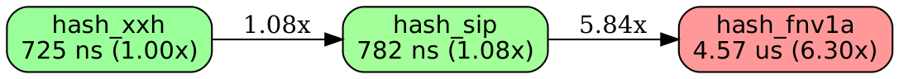

## hash_algos/hash_algos_n4096 on macos-aarch64-c8-bare-apple

Run `20261116T132211Z-07a9e9a3`.

| variant | median | vs best |
|---|---|---|
| hash_xxh | 1.07 us | 1.00x |
| hash_sip | 1.12 us | 1.05x |
| hash_fnv1a | 5.06 us | 4.73x |

## hash_algos/hash_algos_n64 on linux-x86_64-c16-bare-intel

Run `20261115T050751Z-266650fb-dirty`.

| variant | median | vs best |
|---|---|---|
| hash_xxh | 19 ns | 1.00x |
| hash_sip | 22 ns | 1.21x |
| hash_fnv1a | 78 ns | 4.19x |

## hash_algos/hash_algos_n64 on macos-aarch64-c8-bare-apple

Run `20261116T132211Z-07a9e9a3`.

| variant | median | vs best |
|---|---|---|
| hash_xxh | 4 ns | 1.00x |
| hash_sip | 10 ns | 2.48x |
| hash_fnv1a | 35 ns | 8.29x |

## inline_strategy/inline_strategy_n1024 on linux-x86_64-c16-bare-intel

Run `20261115T052342Z-266650fb-dirty`.

| variant | median | vs best |
|---|---|---|
| inline_always | 1.15 us | 1.00x |
| inline_default | 1.15 us | 1.00x |
| inline_never | 1.15 us | 1.00x |

## inline_strategy/inline_strategy_n1024 on macos-aarch64-c8-bare-apple

Run `20261116T132258Z-07a9e9a3`.

| variant | median | vs best |
|---|---|---|
| inline_default | 1.23 us | 1.00x |
| inline_always | 1.23 us | 1.00x |
| inline_never | 1.28 us | 1.04x |

## inline_strategy/inline_strategy_n16384 on linux-x86_64-c16-bare-intel

Run `20261115T052848Z-266650fb-dirty`.

| variant | median | vs best |
|---|---|---|
| inline_default | 18.27 us | 1.00x |
| inline_always | 18.27 us | 1.00x |
| inline_never | 18.27 us | 1.00x |

## inline_strategy/inline_strategy_n16384 on macos-aarch64-c8-bare-apple

Run `20261116T132258Z-07a9e9a3`.

| variant | median | vs best |
|---|---|---|
| inline_default | 20.41 us | 1.00x |
| inline_always | 20.41 us | 1.00x |
| inline_never | 20.46 us | 1.00x |

## inline_strategy/inline_strategy_n256 on linux-x86_64-c16-bare-intel

Run `20261115T052107Z-266650fb-dirty`.

| variant | median | vs best |
|---|---|---|
| inline_always | 292 ns | 1.00x |
| inline_default | 292 ns | 1.00x |
| inline_never | 293 ns | 1.00x |

## inline_strategy/inline_strategy_n256 on macos-aarch64-c8-bare-apple

Run `20261116T132258Z-07a9e9a3`.

| variant | median | vs best |
|---|---|---|
| inline_always | 268 ns | 1.00x |
| inline_default | 268 ns | 1.00x |
| inline_never | 317 ns | 1.18x |

## inline_strategy/inline_strategy_n4096 on linux-x86_64-c16-bare-intel

Run `20261115T052615Z-266650fb`.

| variant | median | vs best |
|---|---|---|
| inline_never | 4.57 us | 1.00x |

## inline_strategy/inline_strategy_n4096 on macos-aarch64-c8-bare-apple

Run `20261116T132258Z-07a9e9a3`.

| variant | median | vs best |
|---|---|---|
| inline_always | 5.06 us | 1.00x |
| inline_default | 5.06 us | 1.00x |
| inline_never | 5.11 us | 1.01x |

## iter_patterns/iter_patterns_n1024 on linux-x86_64-c16-bare-intel

Run `20261115T053425Z-266650fb-dirty`.

| variant | median | vs best |
|---|---|---|
| iter_strided | 25 ns | 1.00x |
| iter_seq | 150 ns | 5.93x |
| iter_gather | 297 ns | 11.80x |

## iter_patterns/iter_patterns_n1024 on macos-aarch64-c8-bare-apple

Run `20261116T132342Z-07a9e9a3`.

| variant | median | vs best |
|---|---|---|
| iter_strided | 3 ns | 1.00x |
| iter_seq | 108 ns | 32.82x |
| iter_gather | 249 ns | 75.52x |

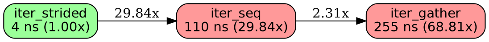

## iter_patterns/iter_patterns_n16384 on linux-x86_64-c16-bare-intel

Run `20261115T053929Z-266650fb-dirty`.

| variant | median | vs best |
|---|---|---|
| iter_strided | 292 ns | 1.00x |
| iter_seq | 2.29 us | 7.83x |
| iter_gather | 4.63 us | 15.86x |

## iter_patterns/iter_patterns_n16384 on macos-aarch64-c8-bare-apple

Run `20261116T132342Z-07a9e9a3`.

| variant | median | vs best |
|---|---|---|
| iter_strided | 270 ns | 1.00x |
| iter_seq | 2.51 us | 9.29x |
| iter_gather | 4.59 us | 17.00x |

## iter_patterns/iter_patterns_n256 on linux-x86_64-c16-bare-intel

Run `20261115T053150Z-266650fb-dirty`.

| variant | median | vs best |
|---|---|---|
| iter_strided | 12 ns | 1.00x |
| iter_seq | 43 ns | 3.71x |
| iter_gather | 82 ns | 7.10x |

## iter_patterns/iter_patterns_n256 on macos-aarch64-c8-bare-apple

Run `20261116T132342Z-07a9e9a3`.

| variant | median | vs best |
|---|---|---|
| iter_strided | 1 ns | 1.00x |
| iter_seq | 16 ns | 20.25x |
| iter_gather | 42 ns | 53.12x |

## iter_patterns/iter_patterns_n4096 on linux-x86_64-c16-bare-intel

Run `20261115T053657Z-266650fb-dirty`.

| variant | median | vs best |
|---|---|---|
| iter_strided | 78 ns | 1.00x |
| iter_seq | 577 ns | 7.36x |
| iter_gather | 1.16 us | 14.85x |

## iter_patterns/iter_patterns_n4096 on macos-aarch64-c8-bare-apple

Run `20261116T132342Z-07a9e9a3`.

| variant | median | vs best |
|---|---|---|
| iter_strided | 52 ns | 1.00x |
| iter_seq | 591 ns | 11.43x |
| iter_gather | 1.09 us | 21.15x |

## link-static/dev_n25 on linux-x86_64-c4-container-intel

Run `20261119T144616Z-6c89a959`.

| variant | median | vs best |
|---|---|---|
| default_replay | 78.47 ms | 1.00x |
| default_relink | 186.70 ms | 2.38x |

## link-static/dev_n97 on linux-x86_64-c4-container-intel

Run `20261119T222847Z-2eb71914`.

| variant | median | vs best |
|---|---|---|
| default_replay | 295.63 ms | 1.00x |
| default_relink | 510.24 ms | 1.73x |

## link-static/release_n25 on linux-x86_64-c4-container-intel

Run `20261119T144616Z-6c89a959`.

| variant | median | vs best |
|---|---|---|
| default_replay | 72.02 ms | 1.00x |
| default_relink | 161.64 ms | 2.24x |

## load_alignment/load_alignment_n1024 on linux-x86_64-c16-bare-intel

Run `20261115T054506Z-266650fb-dirty`.

| variant | median | vs best |
|---|---|---|
| load_aligned | 150 ns | 1.00x |
| load_byte_pack | 150 ns | 1.00x |
| load_unaligned | 150 ns | 1.00x |

## load_alignment/load_alignment_n1024 on macos-aarch64-c8-bare-apple

Run `20261116T132424Z-07a9e9a3`.

| variant | median | vs best |
|---|---|---|
| load_aligned | 107 ns | 1.00x |
| load_byte_pack | 107 ns | 1.00x |
| load_unaligned | 107 ns | 1.00x |

## load_alignment/load_alignment_n16384 on linux-x86_64-c16-bare-intel

Run `20261115T055010Z-266650fb-dirty`.

| variant | median | vs best |
|---|---|---|
| load_aligned | 2.29 us | 1.00x |
| load_byte_pack | 2.29 us | 1.00x |
| load_unaligned | 2.29 us | 1.00x |

## load_alignment/load_alignment_n16384 on macos-aarch64-c8-bare-apple

Run `20261116T132424Z-07a9e9a3`.

| variant | median | vs best |
|---|---|---|
| load_unaligned | 2.51 us | 1.00x |
| load_byte_pack | 2.51 us | 1.00x |
| load_aligned | 2.51 us | 1.00x |

## load_alignment/load_alignment_n256 on linux-x86_64-c16-bare-intel

Run `20261115T054231Z-266650fb-dirty`.

| variant | median | vs best |
|---|---|---|
| load_aligned | 43 ns | 1.00x |
| load_byte_pack | 43 ns | 1.00x |
| load_unaligned | 43 ns | 1.00x |

## load_alignment/load_alignment_n256 on macos-aarch64-c8-bare-apple

Run `20261116T132424Z-07a9e9a3`.

| variant | median | vs best |
|---|---|---|
| load_byte_pack | 15 ns | 1.00x |
| load_unaligned | 15 ns | 1.00x |
| load_aligned | 16 ns | 1.03x |

## load_alignment/load_alignment_n4096 on linux-x86_64-c16-bare-intel

Run `20261115T054738Z-266650fb-dirty`.

| variant | median | vs best |
|---|---|---|
| load_aligned | 578 ns | 1.00x |
| load_byte_pack | 578 ns | 1.00x |
| load_unaligned | 578 ns | 1.00x |

## load_alignment/load_alignment_n4096 on macos-aarch64-c8-bare-apple

Run `20261116T132424Z-07a9e9a3`.

| variant | median | vs best |
|---|---|---|
| load_unaligned | 589 ns | 1.00x |
| load_byte_pack | 589 ns | 1.00x |
| load_aligned | 590 ns | 1.00x |

## match_arm_count/match_arm_count_n1024 on linux-x86_64-c16-bare-intel

Run `20261115T055547Z-266650fb-dirty`.

| variant | median | vs best |
|---|---|---|
| match_2_arms | 106 ns | 1.00x |
| match_8_arms | 161 ns | 1.51x |
| match_64_arms | 181 ns | 1.70x |

## match_arm_count/match_arm_count_n1024 on macos-aarch64-c8-bare-apple

Run `20261116T132506Z-07a9e9a3`.

| variant | median | vs best |
|---|---|---|
| match_2_arms | 97 ns | 1.00x |
| match_8_arms | 157 ns | 1.61x |
| match_64_arms | 231 ns | 2.38x |

## match_arm_count/match_arm_count_n16384 on linux-x86_64-c16-bare-intel

Run `20261115T060052Z-266650fb-dirty`.

| variant | median | vs best |
|---|---|---|
| match_2_arms | 1.58 us | 1.00x |
| match_64_arms | 11.31 us | 7.17x |
| match_8_arms | 11.37 us | 7.21x |

## match_arm_count/match_arm_count_n16384 on macos-aarch64-c8-bare-apple

Run `20261116T132506Z-07a9e9a3`.

| variant | median | vs best |
|---|---|---|
| match_2_arms | 1.35 us | 1.00x |
| match_8_arms | 2.47 us | 1.83x |
| match_64_arms | 12.67 us | 9.39x |

## match_arm_count/match_arm_count_n256 on linux-x86_64-c16-bare-intel

Run `20261115T055312Z-266650fb-dirty`.

| variant | median | vs best |
|---|---|---|
| match_8_arms | 30 ns | 1.00x |
| match_2_arms | 33 ns | 1.08x |
| match_64_arms | 39 ns | 1.29x |

## match_arm_count/match_arm_count_n256 on macos-aarch64-c8-bare-apple

Run `20261116T132506Z-07a9e9a3`.

| variant | median | vs best |
|---|---|---|
| match_2_arms | 26 ns | 1.00x |
| match_64_arms | 69 ns | 2.64x |
| match_8_arms | 93 ns | 3.56x |

## match_arm_count/match_arm_count_n4096 on linux-x86_64-c16-bare-intel

Run `20261115T055819Z-266650fb-dirty`.

| variant | median | vs best |
|---|---|---|
| match_2_arms | 404 ns | 1.00x |
| match_8_arms | 663 ns | 1.64x |
| match_64_arms | 747 ns | 1.85x |

## match_arm_count/match_arm_count_n4096 on macos-aarch64-c8-bare-apple

Run `20261116T132506Z-07a9e9a3`.

| variant | median | vs best |
|---|---|---|
| match_2_arms | 348 ns | 1.00x |
| match_8_arms | 622 ns | 1.79x |
| match_64_arms | 877 ns | 2.52x |

## memcpy_patterns/memcpy_patterns_n1024 on linux-x86_64-c16-bare-intel

Run `20261115T060900Z-266650fb-dirty`.

| variant | median | vs best |
|---|---|---|
| memcpy_unrolled | 1.23 us | 1.00x |
| memcpy_naive | 1.23 us | 1.00x |
| memcpy_intrinsic | 1.23 us | 1.00x |

## memcpy_patterns/memcpy_patterns_n1024 on macos-aarch64-c8-bare-apple

Run `20261116T132553Z-07a9e9a3`.

| variant | median | vs best |
|---|---|---|
| memcpy_unrolled | 1.42 us | 1.00x |
| memcpy_intrinsic | 1.42 us | 1.00x |
| memcpy_naive | 1.42 us | 1.00x |

## memcpy_patterns/memcpy_patterns_n16384 on linux-x86_64-c16-bare-intel

Run `20261115T061407Z-266650fb-dirty`.

| variant | median | vs best |
|---|---|---|
| memcpy_naive | 18.27 us | 1.00x |
| memcpy_unrolled | 18.27 us | 1.00x |
| memcpy_intrinsic | 18.27 us | 1.00x |

## memcpy_patterns/memcpy_patterns_n16384 on macos-aarch64-c8-bare-apple

Run `20261116T132553Z-07a9e9a3`.

| variant | median | vs best |
|---|---|---|
| memcpy_intrinsic | 20.41 us | 1.00x |
| memcpy_unrolled | 20.41 us | 1.00x |
| memcpy_naive | 20.41 us | 1.00x |

## memcpy_patterns/memcpy_patterns_n256 on linux-x86_64-c16-bare-intel

Run `20261115T060629Z-266650fb-dirty`.

| variant | median | vs best |
|---|---|---|
| memcpy_naive | 375 ns | 1.00x |
| memcpy_unrolled | 376 ns | 1.00x |
| memcpy_intrinsic | 376 ns | 1.00x |

## memcpy_patterns/memcpy_patterns_n256 on macos-aarch64-c8-bare-apple

Run `20261116T132553Z-07a9e9a3`.

| variant | median | vs best |
|---|---|---|
| memcpy_naive | 461 ns | 1.00x |
| memcpy_intrinsic | 463 ns | 1.01x |
| memcpy_unrolled | 465 ns | 1.01x |

## memcpy_patterns/memcpy_patterns_n4096 on linux-x86_64-c16-bare-intel

Run `20261115T061133Z-266650fb-dirty`.

| variant | median | vs best |
|---|---|---|
| memcpy_intrinsic | 4.25 us | 1.00x |
| memcpy_naive | 4.66 us | 1.10x |
| memcpy_unrolled | 4.66 us | 1.10x |

## memcpy_patterns/memcpy_patterns_n4096 on macos-aarch64-c8-bare-apple

Run `20261116T132553Z-07a9e9a3`.

| variant | median | vs best |
|---|---|---|
| memcpy_unrolled | 5.27 us | 1.00x |
| memcpy_intrinsic | 5.27 us | 1.00x |
| memcpy_naive | 5.27 us | 1.00x |

## memcpy_patterns/memcpy_patterns_n64 on linux-x86_64-c16-bare-intel

Run `20261115T060354Z-266650fb-dirty`.

| variant | median | vs best |
|---|---|---|
| memcpy_naive | 78 ns | 1.00x |
| memcpy_intrinsic | 78 ns | 1.00x |
| memcpy_unrolled | 78 ns | 1.00x |

## memcpy_patterns/memcpy_patterns_n64 on macos-aarch64-c8-bare-apple

Run `20261116T132553Z-07a9e9a3`.

| variant | median | vs best |
|---|---|---|
| memcpy_intrinsic | 35 ns | 1.00x |
| memcpy_naive | 35 ns | 1.00x |
| memcpy_unrolled | 35 ns | 1.00x |

## minmax_strategy/minmax_strategy_n1024 on linux-x86_64-c16-bare-intel

Run `20261115T061944Z-266650fb-dirty`.

| variant | median | vs best |
|---|---|---|
| minmax_branchless | 50 ns | 1.00x |
| minmax_branch | 51 ns | 1.01x |
| minmax_intrinsic | 52 ns | 1.02x |

## minmax_strategy/minmax_strategy_n1024 on macos-aarch64-c8-bare-apple

Run `20261116T132642Z-07a9e9a3`.

| variant | median | vs best |
|---|---|---|
| minmax_branchless | 40 ns | 1.00x |
| minmax_intrinsic | 40 ns | 1.00x |
| minmax_branch | 41 ns | 1.00x |

## minmax_strategy/minmax_strategy_n16384 on linux-x86_64-c16-bare-intel

Run `20261115T062448Z-266650fb-dirty`.

| variant | median | vs best |
|---|---|---|
| minmax_branchless | 670 ns | 1.00x |
| minmax_intrinsic | 720 ns | 1.07x |
| minmax_branch | 720 ns | 1.08x |

## minmax_strategy/minmax_strategy_n16384 on macos-aarch64-c8-bare-apple

Run `20261116T132642Z-07a9e9a3`.

| variant | median | vs best |
|---|---|---|
| minmax_branch | 378 ns | 1.00x |
| minmax_intrinsic | 379 ns | 1.00x |
| minmax_branchless | 383 ns | 1.01x |

## minmax_strategy/minmax_strategy_n256 on linux-x86_64-c16-bare-intel

Run `20261115T061709Z-266650fb-dirty`.

| variant | median | vs best |
|---|---|---|
| minmax_branch | 34 ns | 1.00x |
| minmax_branchless | 34 ns | 1.00x |
| minmax_intrinsic | 34 ns | 1.00x |

## minmax_strategy/minmax_strategy_n256 on macos-aarch64-c8-bare-apple

Run `20261116T132642Z-07a9e9a3`.

| variant | median | vs best |
|---|---|---|
| minmax_intrinsic | 23 ns | 1.00x |
| minmax_branch | 23 ns | 1.01x |
| minmax_branchless | 23 ns | 1.01x |

## minmax_strategy/minmax_strategy_n4096 on linux-x86_64-c16-bare-intel

Run `20261115T062215Z-266650fb-dirty`.

| variant | median | vs best |
|---|---|---|
| minmax_branch | 185 ns | 1.00x |
| minmax_branchless | 188 ns | 1.01x |
| minmax_intrinsic | 188 ns | 1.01x |

## minmax_strategy/minmax_strategy_n4096 on macos-aarch64-c8-bare-apple

Run `20261116T132642Z-07a9e9a3`.

| variant | median | vs best |
|---|---|---|
| minmax_branch | 109 ns | 1.00x |
| minmax_branchless | 109 ns | 1.00x |
| minmax_intrinsic | 110 ns | 1.01x |

## modulo_strategy/modulo_strategy_n1024 on linux-x86_64-c16-bare-intel

Run `20261115T063029Z-266650fb-dirty`.

| variant | median | vs best |
|---|---|---|
| mod_pow2_const | 1.22 us | 1.00x |
| mod_npow2_const | 2.93 us | 2.41x |
| mod_var | 6.29 us | 5.16x |

## modulo_strategy/modulo_strategy_n1024 on macos-aarch64-c8-bare-apple

Run `20261116T132724Z-07a9e9a3`.

| variant | median | vs best |
|---|---|---|
| mod_pow2_const | 1.55 us | 1.00x |
| mod_npow2_const | 3.46 us | 2.23x |
| mod_var | 4.39 us | 2.83x |

## modulo_strategy/modulo_strategy_n16384 on linux-x86_64-c16-bare-intel

Run `20261115T063541Z-266650fb-dirty`.

| variant | median | vs best |
|---|---|---|
| mod_pow2_const | 19.41 us | 1.00x |
| mod_npow2_const | 57.06 us | 2.94x |
| mod_var | 100.43 us | 5.18x |

## modulo_strategy/modulo_strategy_n16384 on macos-aarch64-c8-bare-apple

Run `20261116T132724Z-07a9e9a3`.

| variant | median | vs best |
|---|---|---|
| mod_pow2_const | 25.53 us | 1.00x |
| mod_npow2_const | 56.41 us | 2.21x |
| mod_var | 71.60 us | 2.80x |

## modulo_strategy/modulo_strategy_n256 on linux-x86_64-c16-bare-intel

Run `20261115T062754Z-266650fb-dirty`.

| variant | median | vs best |
|---|---|---|
| mod_pow2_const | 310 ns | 1.00x |
| mod_npow2_const | 898 ns | 2.90x |
| mod_var | 1.58 us | 5.09x |

## modulo_strategy/modulo_strategy_n256 on macos-aarch64-c8-bare-apple

Run `20261116T132724Z-07a9e9a3`.

| variant | median | vs best |
|---|---|---|
| mod_pow2_const | 352 ns | 1.00x |
| mod_npow2_const | 821 ns | 2.33x |
| mod_var | 1.04 us | 2.94x |

## modulo_strategy/modulo_strategy_n4096 on linux-x86_64-c16-bare-intel

Run `20261115T063303Z-266650fb-dirty`.

| variant | median | vs best |
|---|---|---|
| mod_pow2_const | 4.85 us | 1.00x |
| mod_npow2_const | 14.27 us | 2.94x |
| mod_var | 25.11 us | 5.18x |

## modulo_strategy/modulo_strategy_n4096 on macos-aarch64-c8-bare-apple

Run `20261116T132724Z-07a9e9a3`.

| variant | median | vs best |
|---|---|---|
| mod_pow2_const | 6.35 us | 1.00x |
| mod_npow2_const | 14.04 us | 2.21x |
| mod_var | 17.84 us | 2.81x |

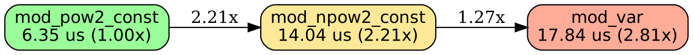

## popcount_strategy/popcount_strategy_n1024 on linux-x86_64-c16-bare-intel

Run `20261115T064350Z-266650fb-dirty`.

| variant | median | vs best |
|---|---|---|
| popcount_std | 93 ns | 1.00x |
| popcount_swar | 189 ns | 2.03x |
| popcount_handrolled | 1.80 us | 19.36x |

## popcount_strategy/popcount_strategy_n1024 on macos-aarch64-c8-bare-apple

Run `20261116T132814Z-07a9e9a3`.

| variant | median | vs best |
|---|---|---|
| popcount_std | 35 ns | 1.00x |
| popcount_swar | 148 ns | 4.27x |
| popcount_handrolled | 148 ns | 4.29x |

## popcount_strategy/popcount_strategy_n16384 on linux-x86_64-c16-bare-intel

Run `20261115T064856Z-266650fb-dirty`.

| variant | median | vs best |
|---|---|---|
| popcount_std | 1.28 us | 1.00x |
| popcount_swar | 2.73 us | 2.13x |
| popcount_handrolled | 37.29 us | 29.04x |

## popcount_strategy/popcount_strategy_n16384 on macos-aarch64-c8-bare-apple

Run `20261116T132814Z-07a9e9a3`.

| variant | median | vs best |
|---|---|---|
| popcount_std | 271 ns | 1.00x |
| popcount_handrolled | 1.95 us | 7.18x |
| popcount_swar | 1.95 us | 7.18x |

## popcount_strategy/popcount_strategy_n256 on linux-x86_64-c16-bare-intel

Run `20261115T064118Z-266650fb-dirty`.

| variant | median | vs best |
|---|---|---|
| popcount_std | 33 ns | 1.00x |
| popcount_swar | 67 ns | 2.05x |
| popcount_handrolled | 354 ns | 10.83x |

## popcount_strategy/popcount_strategy_n256 on macos-aarch64-c8-bare-apple

Run `20261116T132814Z-07a9e9a3`.

| variant | median | vs best |
|---|---|---|
| popcount_std | 4 ns | 1.00x |
| popcount_handrolled | 38 ns | 10.19x |
| popcount_swar | 38 ns | 10.24x |

## popcount_strategy/popcount_strategy_n4096 on linux-x86_64-c16-bare-intel

Run `20261115T064622Z-266650fb-dirty`.

| variant | median | vs best |
|---|---|---|
| popcount_std | 331 ns | 1.00x |
| popcount_swar | 693 ns | 2.09x |
| popcount_handrolled | 8.04 us | 24.30x |

## popcount_strategy/popcount_strategy_n4096 on macos-aarch64-c8-bare-apple

Run `20261116T132814Z-07a9e9a3`.

| variant | median | vs best |
|---|---|---|
| popcount_std | 86 ns | 1.00x |
| popcount_swar | 507 ns | 5.88x |
| popcount_handrolled | 512 ns | 5.94x |

## popcount_strategy/popcount_strategy_n64 on linux-x86_64-c16-bare-intel

Run `20261115T063843Z-266650fb-dirty`.

| variant | median | vs best |
|---|---|---|
| popcount_std | 15 ns | 1.00x |
| popcount_swar | 22 ns | 1.42x |
| popcount_handrolled | 91 ns | 5.96x |

## popcount_strategy/popcount_strategy_n64 on macos-aarch64-c8-bare-apple

Run `20261116T132814Z-07a9e9a3`.

| variant | median | vs best |
|---|---|---|
| popcount_std | 0 ns | 1.00x |
| popcount_swar | 4 ns | 11.00x |
| popcount_handrolled | 5 ns | 11.50x |

## rcm_order/rcm_order_n1024 on macos-aarch64-c8-bare-apple

Run `20261116T132937Z-07a9e9a3`.

| variant | median | vs best |
|---|---|---|
| rcm_rev | 1.78 ms | 1.00x |
| rcm_adj | 1.84 ms | 1.04x |
| rcm_half | 1.88 ms | 1.06x |
| rcm_scr | 1.94 ms | 1.09x |

## rcm_order/rcm_order_n16384 on macos-aarch64-c8-bare-apple

Run `20261116T132937Z-07a9e9a3`.

| variant | median | vs best |
|---|---|---|
| rcm_adj | 42.92 ms | 1.00x |
| rcm_rev | 44.91 ms | 1.05x |
| rcm_half | 46.57 ms | 1.08x |
| rcm_scr | 50.89 ms | 1.19x |

## rcm_order/rcm_order_n2048 on macos-aarch64-c8-bare-apple

Run `20261116T132937Z-07a9e9a3`.

| variant | median | vs best |
|---|---|---|
| rcm_rev | 3.97 ms | 1.00x |
| rcm_adj | 3.98 ms | 1.00x |
| rcm_half | 4.07 ms | 1.02x |
| rcm_scr | 4.11 ms | 1.03x |

## rcm_order/rcm_order_n256 on macos-aarch64-c8-bare-apple

Run `20261116T132937Z-07a9e9a3`.

| variant | median | vs best |
|---|---|---|
| rcm_adj | 312.96 us | 1.00x |
| rcm_rev | 315.45 us | 1.01x |
| rcm_half | 315.91 us | 1.01x |
| rcm_scr | 317.14 us | 1.01x |

## rcm_order/rcm_order_n4096 on macos-aarch64-c8-bare-apple

Run `20261116T132937Z-07a9e9a3`.

| variant | median | vs best |
|---|---|---|
| rcm_rev | 8.39 ms | 1.00x |
| rcm_scr | 8.40 ms | 1.00x |
| rcm_adj | 8.43 ms | 1.00x |
| rcm_half | 8.45 ms | 1.01x |

## rcm_order/rcm_order_n64 on macos-aarch64-c8-bare-apple

Run `20261116T132937Z-07a9e9a3`.

| variant | median | vs best |
|---|---|---|
| rcm_rev | 80.33 us | 1.00x |
| rcm_adj | 80.39 us | 1.00x |
| rcm_scr | 80.46 us | 1.00x |
| rcm_half | 80.90 us | 1.01x |

## rcm_order/rcm_order_n8192 on macos-aarch64-c8-bare-apple

Run `20261116T132937Z-07a9e9a3`.

| variant | median | vs best |
|---|---|---|
| rcm_adj | 17.49 ms | 1.00x |
| rcm_scr | 17.55 ms | 1.00x |
| rcm_rev | 17.88 ms | 1.02x |
| rcm_half | 17.88 ms | 1.02x |

## rcm_rivals/rcm_rivals_n1024 on macos-aarch64-c8-bare-apple

Run `20261116T143606Z-07a9e9a3`.

| variant | median | vs best |
|---|---|---|
| riv_snake | 4.88 ms | 1.00x |
| riv_rowm | 5.05 ms | 1.03x |
| riv_spec | 5.11 ms | 1.05x |
| riv_scr | 5.21 ms | 1.07x |
| riv_rcm | 5.33 ms | 1.09x |

## rcm_rivals/rcm_rivals_n16384 on macos-aarch64-c8-bare-apple

Run `20261116T143606Z-07a9e9a3`.

| variant | median | vs best |
|---|---|---|
| riv_snake | 63.93 ms | 1.00x |
| riv_rcm | 64.51 ms | 1.01x |
| riv_rowm | 64.92 ms | 1.02x |
| riv_scr | 65.60 ms | 1.03x |
| riv_spec | 67.55 ms | 1.06x |

## rcm_rivals/rcm_rivals_n2048 on macos-aarch64-c8-bare-apple

Run `20261116T143606Z-07a9e9a3`.

| variant | median | vs best |
|---|---|---|
| riv_rcm | 8.12 ms | 1.00x |
| riv_spec | 8.34 ms | 1.03x |
| riv_snake | 8.44 ms | 1.04x |
| riv_scr | 8.50 ms | 1.05x |
| riv_rowm | 8.57 ms | 1.06x |

## rcm_rivals/rcm_rivals_n256 on macos-aarch64-c8-bare-apple

Run `20261116T143606Z-07a9e9a3`.

| variant | median | vs best |
|---|---|---|
| riv_spec | 1.03 ms | 1.00x |
| riv_snake | 1.04 ms | 1.02x |
| riv_rcm | 1.07 ms | 1.04x |
| riv_rowm | 1.08 ms | 1.05x |
| riv_scr | 1.11 ms | 1.08x |

## rcm_rivals/rcm_rivals_n4096 on macos-aarch64-c8-bare-apple

Run `20261116T143606Z-07a9e9a3`.

| variant | median | vs best |
|---|---|---|
| riv_snake | 20.17 ms | 1.00x |
| riv_rowm | 20.44 ms | 1.01x |
| riv_scr | 20.48 ms | 1.02x |
| riv_rcm | 20.95 ms | 1.04x |
| riv_spec | 21.19 ms | 1.05x |

## rcm_rivals/rcm_rivals_n64 on macos-aarch64-c8-bare-apple

Run `20261116T143606Z-07a9e9a3`.

| variant | median | vs best |
|---|---|---|
| riv_snake | 208.76 us | 1.00x |
| riv_spec | 209.90 us | 1.01x |
| riv_scr | 211.82 us | 1.01x |
| riv_rcm | 214.64 us | 1.03x |
| riv_rowm | 215.62 us | 1.03x |

## rcm_rivals/rcm_rivals_n8192 on macos-aarch64-c8-bare-apple

Run `20261116T143606Z-07a9e9a3`.

| variant | median | vs best |
|---|---|---|
| riv_spec | 42.08 ms | 1.00x |
| riv_scr | 42.47 ms | 1.01x |
| riv_rowm | 42.79 ms | 1.02x |
| riv_snake | 43.18 ms | 1.03x |
| riv_rcm | 43.75 ms | 1.04x |

## registration_binding/registration_binding_n16384 on linux-x86_64-c16-bare-intel

Run `20261115T090031Z-266650fb-dirty`.

| variant | median | vs best |
|---|---|---|
| reg_typed_twin | 2.53 us | 1.00x |
| reg_bound_units | 2.77 us | 1.10x |
| reg_bound_columns | 2.79 us | 1.10x |
| reg_typed | 3.02 us | 1.19x |
| reg_bound_strided | 5.62 us | 2.22x |
| reg_bound_record | 18.11 us | 7.16x |

## registration_binding/registration_binding_n16384 on macos-aarch64-c8-bare-apple

Run `20261116T163934Z-07a9e9a3`.

| variant | median | vs best |
|---|---|---|
| reg_typed | 845 ns | 1.00x |
| reg_typed_twin | 845 ns | 1.00x |
| reg_bound_columns | 850 ns | 1.01x |
| reg_bound_units | 863 ns | 1.02x |
| reg_bound_strided | 4.97 us | 5.88x |
| reg_bound_record | 21.90 us | 25.90x |

## registration_binding/registration_binding_n262144 on linux-x86_64-c16-bare-intel

Run `20261115T091356Z-266650fb-dirty`.

| variant | median | vs best |
|---|---|---|
| reg_typed_twin | 47.69 us | 1.00x |
| reg_typed | 47.70 us | 1.00x |
| reg_bound_units | 48.12 us | 1.01x |
| reg_bound_columns | 48.57 us | 1.02x |
| reg_bound_strided | 72.48 us | 1.52x |
| reg_bound_record | 292.09 us | 6.12x |

## registration_binding/registration_binding_n262144 on macos-aarch64-c8-bare-apple

Run `20261116T163934Z-07a9e9a3`.

| variant | median | vs best |
|---|---|---|
| reg_typed | 16.53 us | 1.00x |
| reg_typed_twin | 16.62 us | 1.01x |
| reg_bound_columns | 17.19 us | 1.04x |
| reg_bound_units | 17.62 us | 1.07x |
| reg_bound_strided | 79.58 us | 4.81x |
| reg_bound_record | 352.90 us | 21.34x |

## registration_binding/registration_binding_n4096 on linux-x86_64-c16-bare-intel

Run `20261115T085521Z-266650fb-dirty`.

| variant | median | vs best |
|---|---|---|
| reg_typed | 620 ns | 1.00x |
| reg_typed_twin | 620 ns | 1.00x |
| reg_bound_units | 629 ns | 1.01x |
| reg_bound_columns | 761 ns | 1.23x |
| reg_bound_strided | 1.14 us | 1.83x |
| reg_bound_record | 5.53 us | 8.91x |

## registration_binding/registration_binding_n4096 on macos-aarch64-c8-bare-apple

Run `20261116T163934Z-07a9e9a3`.

| variant | median | vs best |
|---|---|---|
| reg_bound_units | 215 ns | 1.00x |
| reg_bound_columns | 218 ns | 1.01x |
| reg_typed | 230 ns | 1.07x |
| reg_typed_twin | 230 ns | 1.07x |
| reg_bound_strided | 1.25 us | 5.81x |
| reg_bound_record | 5.47 us | 25.38x |

## registration_binding/registration_binding_n65536 on linux-x86_64-c16-bare-intel

Run `20261115T090613Z-266650fb-dirty`.

| variant | median | vs best |
|---|---|---|
| reg_typed_twin | 11.95 us | 1.00x |
| reg_typed | 11.96 us | 1.00x |
| reg_bound_units | 12.21 us | 1.02x |
| reg_bound_columns | 12.35 us | 1.03x |
| reg_bound_strided | 22.09 us | 1.85x |
| reg_bound_record | 89.13 us | 7.46x |

## registration_binding/registration_binding_n65536 on macos-aarch64-c8-bare-apple

Run `20261116T163934Z-07a9e9a3`.

| variant | median | vs best |
|---|---|---|
| reg_typed | 4.35 us | 1.00x |
| reg_typed_twin | 4.35 us | 1.00x |
| reg_bound_columns | 4.49 us | 1.03x |
| reg_bound_units | 4.59 us | 1.05x |
| reg_bound_strided | 20.02 us | 4.60x |
| reg_bound_record | 88.71 us | 20.37x |

## resource_storage/false_sharing_n1024 on macos-aarch64-c8-bare-apple

Run `20261116T164410Z-07a9e9a3`.

| variant | median | vs best |
|---|---|---|
| fs_padded | 775.75 us | 1.00x |
| fs_packed | 1.98 ms | 2.56x |

## resource_storage/false_sharing_n16384 on macos-aarch64-c8-bare-apple

Run `20261116T164410Z-07a9e9a3`.

| variant | median | vs best |
|---|---|---|
| fs_padded | 11.54 ms | 1.00x |
| fs_packed | 31.70 ms | 2.75x |

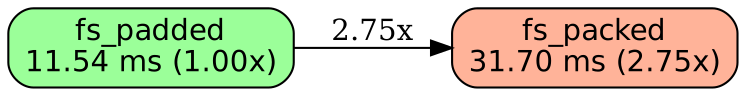

## resource_storage/false_sharing_n65536 on macos-aarch64-c8-bare-apple

Run `20261116T164410Z-07a9e9a3`.

| variant | median | vs best |
|---|---|---|
| fs_padded | 40.56 ms | 1.00x |
| fs_packed | 126.02 ms | 3.11x |

## resource_storage/rsb_bwide_n16384 on macos-aarch64-c8-bare-apple

Run `20261116T164410Z-07a9e9a3`.

| variant | median | vs best |
|---|---|---|
| wide_blob | 4.16 us | 1.00x |
| wide_decomposed | 7.96 us | 1.91x |

## resource_storage/rsb_bwide_n256 on macos-aarch64-c8-bare-apple

Run `20261116T164410Z-07a9e9a3`.

| variant | median | vs best |
|---|---|---|
| wide_blob | 17.18 us | 1.00x |
| wide_decomposed | 32.58 us | 1.90x |

## resource_storage/rsb_bwide_n4194304 on macos-aarch64-c8-bare-apple

Run `20261116T164410Z-07a9e9a3`.

| variant | median | vs best |
|---|---|---|
| wide_blob | 46 ns | 1.00x |
| wide_decomposed | 139 ns | 2.98x |

## resource_storage/rsb_clean_n1024 on macos-aarch64-c8-bare-apple

Run `20261116T164410Z-07a9e9a3`.

| variant | median | vs best |
|---|---|---|
| v0_blob | 28 ns | 1.00x |
| v2_decomposed | 28 ns | 1.00x |
| v1_snapshot | 28 ns | 1.01x |
| v3_shapebound | 28 ns | 1.01x |
| v4_erased | 29 ns | 1.03x |
| v5_handletable | 31 ns | 1.10x |

## resource_storage/rsb_clean_n16384 on macos-aarch64-c8-bare-apple

Run `20261116T164410Z-07a9e9a3`.

| variant | median | vs best |
|---|---|---|
| v3_shapebound | 437 ns | 1.00x |
| v2_decomposed | 437 ns | 1.00x |
| v1_snapshot | 438 ns | 1.00x |
| v4_erased | 438 ns | 1.00x |
| v0_blob | 438 ns | 1.00x |
| v5_handletable | 442 ns | 1.01x |

## resource_storage/rsb_clean_n262144 on macos-aarch64-c8-bare-apple

Run `20261116T164410Z-07a9e9a3`.

| variant | median | vs best |
|---|---|---|
| v3_shapebound | 6.51 us | 1.00x |
| v0_blob | 6.51 us | 1.00x |
| v1_snapshot | 6.51 us | 1.00x |
| v2_decomposed | 6.52 us | 1.00x |
| v4_erased | 6.52 us | 1.00x |
| v5_handletable | 6.55 us | 1.01x |

## resource_storage/rsb_heavy_thrash_n1024 on macos-aarch64-c8-bare-apple

Run `20261116T164410Z-07a9e9a3`.

| variant | median | vs best |
|---|---|---|
| v0_blob | 27 ns | 1.00x |
| v1_snapshot | 28 ns | 1.01x |
| v3_shapebound | 28 ns | 1.01x |
| v2_decomposed | 28 ns | 1.02x |
| v4_erased | 28 ns | 1.03x |
| v5_handletable | 30 ns | 1.11x |

## resource_storage/rsb_heavy_thrash_n16384 on macos-aarch64-c8-bare-apple

Run `20261116T164410Z-07a9e9a3`.

| variant | median | vs best |
|---|---|---|
| v3_shapebound | 436 ns | 1.00x |
| v1_snapshot | 436 ns | 1.00x |
| v2_decomposed | 436 ns | 1.00x |
| v4_erased | 437 ns | 1.00x |
| v0_blob | 438 ns | 1.00x |
| v5_handletable | 441 ns | 1.01x |

## resource_storage/rsb_heavy_thrash_n262144 on macos-aarch64-c8-bare-apple

Run `20261116T164410Z-07a9e9a3`.

| variant | median | vs best |
|---|---|---|
| v3_shapebound | 6.50 us | 1.00x |
| v0_blob | 6.51 us | 1.00x |
| v1_snapshot | 6.51 us | 1.00x |
| v2_decomposed | 6.51 us | 1.00x |
| v4_erased | 6.52 us | 1.00x |
| v5_handletable | 6.56 us | 1.01x |

## resource_storage/rsb_light_thrash_n1024 on macos-aarch64-c8-bare-apple

Run `20261116T164410Z-07a9e9a3`.

| variant | median | vs best |
|---|---|---|
| v0_blob | 28 ns | 1.00x |
| v1_snapshot | 28 ns | 1.01x |
| v3_shapebound | 28 ns | 1.01x |
| v2_decomposed | 28 ns | 1.01x |
| v4_erased | 28 ns | 1.01x |
| v5_handletable | 30 ns | 1.09x |

## resource_storage/rsb_light_thrash_n16384 on macos-aarch64-c8-bare-apple

Run `20261116T164410Z-07a9e9a3`.

| variant | median | vs best |
|---|---|---|
| v3_shapebound | 436 ns | 1.00x |
| v1_snapshot | 436 ns | 1.00x |
| v2_decomposed | 437 ns | 1.00x |
| v4_erased | 437 ns | 1.00x |
| v0_blob | 438 ns | 1.00x |
| v5_handletable | 442 ns | 1.01x |

## resource_storage/rsb_light_thrash_n262144 on macos-aarch64-c8-bare-apple

Run `20261116T164410Z-07a9e9a3`.

| variant | median | vs best |
|---|---|---|
| v3_shapebound | 6.50 us | 1.00x |
| v0_blob | 6.51 us | 1.00x |
| v1_snapshot | 6.51 us | 1.00x |
| v2_decomposed | 6.52 us | 1.00x |
| v4_erased | 6.52 us | 1.00x |
| v5_handletable | 6.55 us | 1.01x |

## resource_storage/rsb_seqd_n1048576 on macos-aarch64-c8-bare-apple

Run `20261116T164410Z-07a9e9a3`.

| variant | median | vs best |
|---|---|---|
| seq_live | 330.49 us | 1.00x |
| seq_snapshot | 404.20 us | 1.22x |

## resource_storage/rsb_seqd_n16777216 on macos-aarch64-c8-bare-apple

Run `20261116T164410Z-07a9e9a3`.

| variant | median | vs best |
|---|---|---|
| seq_live | 1.47 ms | 1.00x |
| seq_snapshot | 3.70 ms | 2.52x |

## resource_storage/rsb_seqd_n4194304 on macos-aarch64-c8-bare-apple

Run `20261116T164410Z-07a9e9a3`.

| variant | median | vs best |
|---|---|---|
| seq_live | 356.61 us | 1.00x |
| seq_snapshot | 817.13 us | 2.29x |

## resource_storage/rsb_seqd_n65536 on macos-aarch64-c8-bare-apple

Run `20261116T164410Z-07a9e9a3`.

| variant | median | vs best |
|---|---|---|
| seq_live | 334.80 us | 1.00x |
| seq_snapshot | 340.56 us | 1.02x |

## rotate_strategy/rotate_strategy_n1024 on linux-x86_64-c16-bare-intel

Run `20261115T091951Z-266650fb-dirty`.

| variant | median | vs best |
|---|---|---|
| rot_intrinsic_const | 65 ns | 1.00x |
| rot_manual_shifts | 79 ns | 1.22x |
| rot_variable_amount | 181 ns | 2.80x |

## rotate_strategy/rotate_strategy_n1024 on macos-aarch64-c8-bare-apple

Run `20261116T183921Z-07a9e9a3`.

| variant | median | vs best |
|---|---|---|
| rot_intrinsic_const | 72 ns | 1.00x |
| rot_manual_shifts | 72 ns | 1.00x |
| rot_variable_amount | 235 ns | 3.27x |

## rotate_strategy/rotate_strategy_n16384 on linux-x86_64-c16-bare-intel

Run `20261115T092455Z-266650fb-dirty`.

| variant | median | vs best |
|---|---|---|
| rot_intrinsic_const | 1.15 us | 1.00x |
| rot_manual_shifts | 1.15 us | 1.00x |
| rot_variable_amount | 3.43 us | 2.99x |

## rotate_strategy/rotate_strategy_n16384 on macos-aarch64-c8-bare-apple

Run `20261116T183921Z-07a9e9a3`.

| variant | median | vs best |
|---|---|---|
| rot_intrinsic_const | 1.28 us | 1.00x |
| rot_manual_shifts | 1.28 us | 1.00x |
| rot_variable_amount | 3.90 us | 3.05x |

## rotate_strategy/rotate_strategy_n256 on linux-x86_64-c16-bare-intel

Run `20261115T091717Z-266650fb-dirty`.

| variant | median | vs best |
|---|---|---|
| rot_intrinsic_const | 21 ns | 1.00x |
| rot_manual_shifts | 25 ns | 1.22x |
| rot_variable_amount | 59 ns | 2.81x |

## rotate_strategy/rotate_strategy_n256 on macos-aarch64-c8-bare-apple

Run `20261116T183921Z-07a9e9a3`.

| variant | median | vs best |
|---|---|---|
| rot_intrinsic_const | 5 ns | 1.00x |
| rot_manual_shifts | 6 ns | 1.07x |
| rot_variable_amount | 48 ns | 8.80x |

## rotate_strategy/rotate_strategy_n4096 on linux-x86_64-c16-bare-intel

Run `20261115T092224Z-266650fb`.

| variant | median | vs best |
|---|---|---|
| rot_manual_shifts | 293 ns | 1.00x |
| rot_variable_amount | 862 ns | 2.94x |

## rotate_strategy/rotate_strategy_n4096 on macos-aarch64-c8-bare-apple

Run `20261116T183921Z-07a9e9a3`.

| variant | median | vs best |
|---|---|---|
| rot_manual_shifts | 300 ns | 1.00x |
| rot_intrinsic_const | 301 ns | 1.00x |
| rot_variable_amount | 968 ns | 3.22x |

## sat_arithmetic/sat_arithmetic_n1024 on linux-x86_64-c16-bare-intel

Run `20261115T093033Z-266650fb`.

| variant | median | vs best |
|---|---|---|
| sat_wrap | 295 ns | 1.00x |
| sat_saturate | 504 ns | 1.71x |

## sat_arithmetic/sat_arithmetic_n1024 on macos-aarch64-c8-bare-apple

Run `20261116T184004Z-07a9e9a3`.

| variant | median | vs best |
|---|---|---|
| sat_wrap | 352 ns | 1.00x |
| sat_checked | 666 ns | 1.89x |
| sat_saturate | 666 ns | 1.89x |

## sat_arithmetic/sat_arithmetic_n16384 on linux-x86_64-c16-bare-intel

Run `20261115T093537Z-266650fb-dirty`.

| variant | median | vs best |
|---|---|---|
| sat_wrap | 4.57 us | 1.00x |
| sat_saturate | 7.80 us | 1.71x |
| sat_checked | 7.80 us | 1.71x |

## sat_arithmetic/sat_arithmetic_n16384 on macos-aarch64-c8-bare-apple

Run `20261116T184004Z-07a9e9a3`.

| variant | median | vs best |
|---|---|---|
| sat_wrap | 5.25 us | 1.00x |
| sat_saturate | 10.49 us | 2.00x |
| sat_checked | 10.52 us | 2.01x |

## sat_arithmetic/sat_arithmetic_n256 on linux-x86_64-c16-bare-intel

Run `20261115T092757Z-266650fb-dirty`.

| variant | median | vs best |
|---|---|---|
| sat_wrap | 81 ns | 1.00x |
| sat_checked | 140 ns | 1.72x |
| sat_saturate | 140 ns | 1.72x |

## sat_arithmetic/sat_arithmetic_n256 on macos-aarch64-c8-bare-apple

Run `20261116T184004Z-07a9e9a3`.

| variant | median | vs best |
|---|---|---|
| sat_wrap | 104 ns | 1.00x |
| sat_saturate | 176 ns | 1.69x |
| sat_checked | 177 ns | 1.70x |

## sat_arithmetic/sat_arithmetic_n4096 on linux-x86_64-c16-bare-intel

Run `20261115T093304Z-266650fb-dirty`.

| variant | median | vs best |
|---|---|---|
| sat_wrap | 1.15 us | 1.00x |
| sat_checked | 1.97 us | 1.71x |
| sat_saturate | 1.97 us | 1.72x |

## sat_arithmetic/sat_arithmetic_n4096 on macos-aarch64-c8-bare-apple

Run `20261116T184004Z-07a9e9a3`.

| variant | median | vs best |
|---|---|---|
| sat_wrap | 1.33 us | 1.00x |
| sat_checked | 2.62 us | 1.97x |
| sat_saturate | 2.62 us | 1.97x |

## shift_amount_origin/shift_amount_origin_n1024 on linux-x86_64-c16-bare-intel

Run `20261115T094114Z-266650fb-dirty`.

| variant | median | vs best |
|---|---|---|
| shr_const | 19 ns | 1.00x |
| shr_loop_invariant | 20 ns | 1.03x |
| shr_per_iter | 94 ns | 4.90x |

## shift_amount_origin/shift_amount_origin_n1024 on macos-aarch64-c8-bare-apple

Run `20261116T184049Z-07a9e9a3`.

| variant | median | vs best |
|---|---|---|
| shr_const | 5 ns | 1.00x |
| shr_loop_invariant | 6 ns | 1.20x |
| shr_per_iter | 63 ns | 12.58x |

## shift_amount_origin/shift_amount_origin_n16384 on linux-x86_64-c16-bare-intel

Run `20261115T094618Z-266650fb-dirty`.

| variant | median | vs best |
|---|---|---|
| shr_const | 131 ns | 1.00x |
| shr_loop_invariant | 203 ns | 1.56x |
| shr_per_iter | 1.33 us | 10.22x |

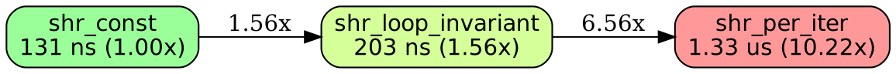

## shift_amount_origin/shift_amount_origin_n16384 on macos-aarch64-c8-bare-apple

Run `20261116T184049Z-07a9e9a3`.

| variant | median | vs best |
|---|---|---|
| shr_const | 192 ns | 1.00x |
| shr_loop_invariant | 194 ns | 1.01x |
| shr_per_iter | 679 ns | 3.53x |

## shift_amount_origin/shift_amount_origin_n256 on linux-x86_64-c16-bare-intel

Run `20261115T093839Z-266650fb-dirty`.

| variant | median | vs best |
|---|---|---|
| shr_const | 12 ns | 1.00x |
| shr_loop_invariant | 13 ns | 1.06x |
| shr_per_iter | 26 ns | 2.14x |

## shift_amount_origin/shift_amount_origin_n256 on macos-aarch64-c8-bare-apple

Run `20261116T184049Z-07a9e9a3`.

| variant | median | vs best |
|---|---|---|
| shr_const | 1 ns | 1.00x |
| shr_loop_invariant | 2 ns | 3.12x |
| shr_per_iter | 7 ns | 8.38x |

## shift_amount_origin/shift_amount_origin_n4096 on linux-x86_64-c16-bare-intel

Run `20261115T094346Z-266650fb-dirty`.

| variant | median | vs best |
|---|---|---|
| shr_const | 50 ns | 1.00x |
| shr_loop_invariant | 61 ns | 1.23x |
| shr_per_iter | 342 ns | 6.89x |

## shift_amount_origin/shift_amount_origin_n4096 on macos-aarch64-c8-bare-apple

Run `20261116T184049Z-07a9e9a3`.

| variant | median | vs best |
|---|---|---|
| shr_const | 67 ns | 1.00x |
| shr_loop_invariant | 68 ns | 1.01x |
| shr_per_iter | 186 ns | 2.78x |

## single-trunk-convergence/append_w1_big_n16777216 on macos-aarch64-c8-bare-apple

Run `20261116T184153Z-07a9e9a3`.

| variant | median | vs best |
|---|---|---|
| head_tail_dyn | 2.71 ms | 1.00x |
| std_parallel | 2.75 ms | 1.02x |
| kernel_nway | 2.83 ms | 1.04x |
| head_tail | 2.86 ms | 1.06x |
| kernel_seq | 3.02 ms | 1.12x |
| nway | 11.51 ms | 4.25x |
| sequential | 12.21 ms | 4.51x |

## single-trunk-convergence/append_w1_n1048576 on macos-aarch64-c8-bare-apple

Run `20261116T184153Z-07a9e9a3`.

| variant | median | vs best |
|---|---|---|
| head_tail_dyn | 112.84 us | 1.00x |
| kernel_nway | 112.97 us | 1.00x |
| head_tail | 113.38 us | 1.00x |
| kernel_seq | 114.14 us | 1.01x |
| std_parallel | 130.65 us | 1.16x |
| nway | 730.02 us | 6.47x |
| sequential | 760.02 us | 6.74x |

## single-trunk-convergence/append_w1_n4096 on macos-aarch64-c8-bare-apple

Run `20261116T184153Z-07a9e9a3`.

| variant | median | vs best |
|---|---|---|
| head_tail | 3.01 us | 1.00x |
| head_tail_dyn | 3.03 us | 1.01x |
| kernel_nway | 3.14 us | 1.04x |
| kernel_seq | 3.17 us | 1.05x |
| sequential | 13.02 us | 4.32x |
| nway | 15.70 us | 5.21x |
| std_parallel | 16.92 us | 5.62x |

## single-trunk-convergence/append_w1_n65536 on macos-aarch64-c8-bare-apple

Run `20261116T184153Z-07a9e9a3`.

| variant | median | vs best |
|---|---|---|
| kernel_seq | 9.82 us | 1.00x |
| head_tail_dyn | 9.94 us | 1.01x |
| head_tail | 9.95 us | 1.01x |
| kernel_nway | 9.96 us | 1.01x |
| std_parallel | 24.49 us | 2.49x |
| sequential | 56.15 us | 5.72x |
| nway | 60.70 us | 6.18x |

## single-trunk-convergence/append_w2_big_n16777216 on macos-aarch64-c8-bare-apple

Run `20261116T184153Z-07a9e9a3`.

| variant | median | vs best |
|---|---|---|
| head_tail_dyn | 2.85 ms | 1.00x |
| kernel_seq | 3.00 ms | 1.05x |
| std_parallel | 3.12 ms | 1.09x |
| head_tail | 3.13 ms | 1.10x |
| kernel_nway | 3.17 ms | 1.11x |
| nway | 5.89 ms | 2.06x |
| sequential | 12.15 ms | 4.26x |

## single-trunk-convergence/append_w2_n1048576 on macos-aarch64-c8-bare-apple

Run `20261116T184153Z-07a9e9a3`.

| variant | median | vs best |
|---|---|---|
| kernel_nway | 80.96 us | 1.00x |
| std_parallel | 91.79 us | 1.13x |
| kernel_seq | 112.67 us | 1.39x |
| head_tail | 113.64 us | 1.40x |
| head_tail_dyn | 114.34 us | 1.41x |
| nway | 398.19 us | 4.92x |
| sequential | 758.65 us | 9.37x |

## single-trunk-convergence/append_w2_n4096 on macos-aarch64-c8-bare-apple

Run `20261116T184153Z-07a9e9a3`.

| variant | median | vs best |
|---|---|---|
| kernel_seq | 3.07 us | 1.00x |
| head_tail_dyn | 3.10 us | 1.01x |
| head_tail | 3.33 us | 1.08x |
| kernel_nway | 4.83 us | 1.57x |
| sequential | 13.01 us | 4.24x |
| nway | 21.15 us | 6.89x |
| std_parallel | 28.98 us | 9.44x |

## single-trunk-convergence/append_w2_n65536 on macos-aarch64-c8-bare-apple

Run `20261116T184153Z-07a9e9a3`.

| variant | median | vs best |
|---|---|---|
| kernel_seq | 9.75 us | 1.00x |
| head_tail | 9.78 us | 1.00x |
| head_tail_dyn | 9.89 us | 1.01x |
| kernel_nway | 9.98 us | 1.02x |
| std_parallel | 33.84 us | 3.47x |
| sequential | 55.99 us | 5.74x |
| nway | 60.37 us | 6.19x |

## single-trunk-convergence/append_w4_big_n16777216 on macos-aarch64-c8-bare-apple

Run `20261116T184153Z-07a9e9a3`.

| variant | median | vs best |
|---|---|---|
| head_tail_dyn | 2.34 ms | 1.00x |
| head_tail | 2.35 ms | 1.00x |
| kernel_seq | 2.36 ms | 1.01x |
| kernel_nway | 2.38 ms | 1.01x |
| std_parallel | 2.42 ms | 1.03x |
| nway | 3.26 ms | 1.39x |
| sequential | 11.91 ms | 5.08x |

## single-trunk-convergence/append_w4_n1048576 on macos-aarch64-c8-bare-apple

Run `20261116T184153Z-07a9e9a3`.

| variant | median | vs best |
|---|---|---|
| kernel_nway | 69.45 us | 1.00x |
| std_parallel | 90.61 us | 1.30x |
| head_tail_dyn | 111.26 us | 1.60x |
| kernel_seq | 111.46 us | 1.60x |
| head_tail | 111.84 us | 1.61x |
| nway | 243.62 us | 3.51x |
| sequential | 756.58 us | 10.89x |

## single-trunk-convergence/append_w4_n4096 on macos-aarch64-c8-bare-apple

Run `20261116T184153Z-07a9e9a3`.

| variant | median | vs best |
|---|---|---|
| head_tail_dyn | 2.85 us | 1.00x |
| head_tail | 2.88 us | 1.01x |
| kernel_seq | 2.88 us | 1.01x |
| sequential | 12.94 us | 4.54x |
| kernel_nway | 14.39 us | 5.04x |
| nway | 38.17 us | 13.38x |
| std_parallel | 48.70 us | 17.07x |

## single-trunk-convergence/append_w4_n65536 on macos-aarch64-c8-bare-apple

Run `20261116T184153Z-07a9e9a3`.

| variant | median | vs best |
|---|---|---|
| kernel_seq | 9.56 us | 1.00x |
| head_tail_dyn | 9.57 us | 1.00x |
| head_tail | 9.61 us | 1.00x |
| kernel_nway | 20.80 us | 2.17x |
| std_parallel | 51.25 us | 5.36x |
| sequential | 55.96 us | 5.85x |
| nway | 58.80 us | 6.15x |

## single-trunk-convergence/append_w8_big_n16777216 on macos-aarch64-c8-bare-apple

Run `20261116T184153Z-07a9e9a3`.

| variant | median | vs best |
|---|---|---|
| head_tail_dyn | 2.72 ms | 1.00x |
| head_tail | 2.77 ms | 1.02x |
| kernel_seq | 3.11 ms | 1.14x |
| kernel_nway | 3.39 ms | 1.24x |
| nway | 3.68 ms | 1.35x |
| std_parallel | 3.89 ms | 1.43x |
| sequential | 12.16 ms | 4.47x |

## single-trunk-convergence/append_w8_n1048576 on macos-aarch64-c8-bare-apple

Run `20261116T184153Z-07a9e9a3`.

| variant | median | vs best |
|---|---|---|
| kernel_nway | 72.20 us | 1.00x |
| std_parallel | 109.53 us | 1.52x |
| head_tail_dyn | 111.25 us | 1.54x |
| kernel_seq | 111.44 us | 1.54x |
| head_tail | 111.51 us | 1.54x |
| nway | 211.91 us | 2.93x |
| sequential | 753.82 us | 10.44x |

## single-trunk-convergence/append_w8_n4096 on macos-aarch64-c8-bare-apple

Run `20261116T184153Z-07a9e9a3`.

| variant | median | vs best |
|---|---|---|
| head_tail | 2.85 us | 1.00x |
| head_tail_dyn | 2.86 us | 1.00x |
| kernel_seq | 2.91 us | 1.02x |
| sequential | 12.98 us | 4.55x |
| kernel_nway | 21.20 us | 7.43x |
| nway | 53.31 us | 18.68x |
| std_parallel | 79.47 us | 27.84x |

## single-trunk-convergence/append_w8_n65536 on macos-aarch64-c8-bare-apple

Run `20261116T184153Z-07a9e9a3`.

| variant | median | vs best |
|---|---|---|
| head_tail | 9.50 us | 1.00x |
| kernel_seq | 9.73 us | 1.02x |
| head_tail_dyn | 9.81 us | 1.03x |
| kernel_nway | 25.50 us | 2.68x |
| sequential | 55.85 us | 5.88x |
| nway | 63.61 us | 6.70x |
| std_parallel | 78.69 us | 8.28x |

## single-trunk-convergence/fold_heavy_w1_big_n1048576 on macos-aarch64-c8-bare-apple

Run `20261116T184153Z-07a9e9a3`.

| variant | median | vs best |
|---|---|---|
| head_tail | 760.83 us | 1.00x |
| kernel_seq | 761.36 us | 1.00x |
| kernel_nway | 764.02 us | 1.00x |
| head_tail_dyn | 767.58 us | 1.01x |
| sequential | 773.07 us | 1.02x |
| nway | 775.10 us | 1.02x |
| std_parallel | 778.42 us | 1.02x |

## single-trunk-convergence/fold_heavy_w1_n4096 on macos-aarch64-c8-bare-apple

Run `20261116T184153Z-07a9e9a3`.

| variant | median | vs best |
|---|---|---|
| head_tail | 5.72 us | 1.00x |
| kernel_nway | 5.82 us | 1.02x |
| kernel_seq | 5.85 us | 1.02x |
| head_tail_dyn | 5.92 us | 1.03x |
| sequential | 13.51 us | 2.36x |
| nway | 15.91 us | 2.78x |
| std_parallel | 23.36 us | 4.08x |

## single-trunk-convergence/fold_heavy_w1_n65536 on macos-aarch64-c8-bare-apple

Run `20261116T184153Z-07a9e9a3`.

| variant | median | vs best |
|---|---|---|
| kernel_nway | 52.50 us | 1.00x |
| kernel_seq | 52.84 us | 1.01x |
| head_tail_dyn | 52.89 us | 1.01x |
| head_tail | 52.96 us | 1.01x |
| sequential | 57.43 us | 1.09x |
| nway | 62.52 us | 1.19x |
| std_parallel | 69.05 us | 1.32x |

## single-trunk-convergence/fold_heavy_w2_big_n1048576 on macos-aarch64-c8-bare-apple

Run `20261116T184153Z-07a9e9a3`.

| variant | median | vs best |
|---|---|---|
| kernel_nway | 414.53 us | 1.00x |
| nway | 420.39 us | 1.01x |
| std_parallel | 421.09 us | 1.02x |
| head_tail | 438.43 us | 1.06x |
| head_tail_dyn | 441.24 us | 1.06x |
| kernel_seq | 761.49 us | 1.84x |
| sequential | 767.29 us | 1.85x |

## single-trunk-convergence/fold_heavy_w2_n4096 on macos-aarch64-c8-bare-apple

Run `20261116T184153Z-07a9e9a3`.

| variant | median | vs best |
|---|---|---|
| kernel_seq | 5.87 us | 1.00x |
| head_tail | 6.75 us | 1.15x |
| head_tail_dyn | 6.96 us | 1.18x |
| kernel_nway | 7.79 us | 1.33x |
| sequential | 13.45 us | 2.29x |
| nway | 21.66 us | 3.69x |
| std_parallel | 34.88 us | 5.94x |

## single-trunk-convergence/fold_heavy_w2_n65536 on macos-aarch64-c8-bare-apple

Run `20261116T184153Z-07a9e9a3`.

| variant | median | vs best |
|---|---|---|
| head_tail_dyn | 34.45 us | 1.00x |
| kernel_nway | 51.55 us | 1.50x |
| nway | 52.57 us | 1.53x |
| kernel_seq | 53.04 us | 1.54x |
| head_tail | 53.69 us | 1.56x |
| sequential | 57.39 us | 1.67x |
| std_parallel | 62.70 us | 1.82x |

## single-trunk-convergence/fold_heavy_w4_big_n1048576 on macos-aarch64-c8-bare-apple

Run `20261116T184153Z-07a9e9a3`.

| variant | median | vs best |
|---|---|---|
| kernel_nway | 242.90 us | 1.00x |
| nway | 249.30 us | 1.03x |
| std_parallel | 260.82 us | 1.07x |
| head_tail | 435.79 us | 1.79x |
| head_tail_dyn | 441.64 us | 1.82x |
| kernel_seq | 763.38 us | 3.14x |
| sequential | 763.88 us | 3.14x |

## single-trunk-convergence/fold_heavy_w4_n4096 on macos-aarch64-c8-bare-apple

Run `20261116T184153Z-07a9e9a3`.

| variant | median | vs best |
|---|---|---|
| kernel_seq | 6.23 us | 1.00x |
| head_tail | 6.74 us | 1.08x |
| head_tail_dyn | 7.11 us | 1.14x |
| sequential | 13.38 us | 2.15x |
| kernel_nway | 14.12 us | 2.27x |
| nway | 39.52 us | 6.34x |
| std_parallel | 54.27 us | 8.71x |

## single-trunk-convergence/fold_heavy_w4_n65536 on macos-aarch64-c8-bare-apple

Run `20261116T184153Z-07a9e9a3`.

| variant | median | vs best |
|---|---|---|
| head_tail_dyn | 35.08 us | 1.00x |
| kernel_nway | 46.14 us | 1.32x |
| kernel_seq | 53.05 us | 1.51x |
| head_tail | 53.27 us | 1.52x |
| sequential | 57.39 us | 1.64x |
| nway | 58.61 us | 1.67x |
| std_parallel | 72.10 us | 2.06x |

## single-trunk-convergence/fold_heavy_w8_big_n1048576 on macos-aarch64-c8-bare-apple

Run `20261116T184153Z-07a9e9a3`.

| variant | median | vs best |
|---|---|---|
| kernel_nway | 236.38 us | 1.00x |
| nway | 242.31 us | 1.03x |
| std_parallel | 265.51 us | 1.12x |
| head_tail | 435.07 us | 1.84x |
| head_tail_dyn | 442.80 us | 1.87x |
| kernel_seq | 761.04 us | 3.22x |
| sequential | 770.47 us | 3.26x |

## single-trunk-convergence/fold_heavy_w8_n4096 on macos-aarch64-c8-bare-apple

Run `20261116T184153Z-07a9e9a3`.

| variant | median | vs best |
|---|---|---|
| kernel_seq | 5.58 us | 1.00x |
| head_tail_dyn | 6.96 us | 1.25x |
| head_tail | 7.03 us | 1.26x |
| sequential | 13.13 us | 2.35x |
| kernel_nway | 25.86 us | 4.64x |
| nway | 50.70 us | 9.09x |
| std_parallel | 85.58 us | 15.34x |

## single-trunk-convergence/fold_heavy_w8_n65536 on macos-aarch64-c8-bare-apple

Run `20261116T184153Z-07a9e9a3`.

| variant | median | vs best |
|---|---|---|
| head_tail_dyn | 33.96 us | 1.00x |
| kernel_nway | 52.66 us | 1.55x |
| kernel_seq | 53.19 us | 1.57x |
| head_tail | 54.31 us | 1.60x |
| sequential | 57.61 us | 1.70x |
| nway | 63.82 us | 1.88x |
| std_parallel | 91.88 us | 2.71x |

## single-trunk-convergence/fold_light_w1_big_n134217728 on macos-aarch64-c8-bare-apple

Run `20261116T184153Z-07a9e9a3`.

| variant | median | vs best |
|---|---|---|
| kernel_nway | 13.70 ms | 1.00x |
| std_parallel | 14.59 ms | 1.06x |
| head_tail_dyn | 14.61 ms | 1.07x |
| sequential | 14.67 ms | 1.07x |
| nway | 14.86 ms | 1.08x |
| head_tail | 14.87 ms | 1.09x |
| kernel_seq | 15.48 ms | 1.13x |

## single-trunk-convergence/fold_light_w1_big_n16777216 on macos-aarch64-c8-bare-apple

Run `20261116T184153Z-07a9e9a3`.

| variant | median | vs best |
|---|---|---|
| head_tail_dyn | 1.66 ms | 1.00x |
| nway | 1.72 ms | 1.04x |
| sequential | 1.73 ms | 1.04x |
| head_tail | 1.73 ms | 1.04x |
| kernel_seq | 1.79 ms | 1.08x |
| kernel_nway | 2.00 ms | 1.21x |
| std_parallel | 2.12 ms | 1.28x |

## single-trunk-convergence/fold_light_w1_n1048576 on macos-aarch64-c8-bare-apple

Run `20261116T184153Z-07a9e9a3`.

| variant | median | vs best |
|---|---|---|
| head_tail_dyn | 92.38 us | 1.00x |
| head_tail | 94.60 us | 1.02x |
| kernel_nway | 95.50 us | 1.03x |
| kernel_seq | 96.03 us | 1.04x |
| sequential | 100.23 us | 1.09x |
| nway | 105.80 us | 1.15x |
| std_parallel | 111.07 us | 1.20x |

## single-trunk-convergence/fold_light_w1_n4096 on macos-aarch64-c8-bare-apple

Run `20261116T184153Z-07a9e9a3`.

| variant | median | vs best |
|---|---|---|
| head_tail_dyn | 2.88 us | 1.00x |
| head_tail | 2.88 us | 1.00x |
| kernel_seq | 2.99 us | 1.04x |
| kernel_nway | 3.00 us | 1.04x |
| sequential | 10.38 us | 3.61x |
| nway | 12.72 us | 4.42x |
| std_parallel | 18.85 us | 6.55x |

## single-trunk-convergence/fold_light_w1_n65536 on macos-aarch64-c8-bare-apple

Run `20261116T184153Z-07a9e9a3`.

| variant | median | vs best |
|---|---|---|
| head_tail_dyn | 8.56 us | 1.00x |
| head_tail | 8.62 us | 1.01x |
| kernel_nway | 8.79 us | 1.03x |
| kernel_seq | 8.81 us | 1.03x |
| sequential | 15.72 us | 1.84x |
| nway | 19.29 us | 2.25x |
| std_parallel | 25.48 us | 2.98x |

## single-trunk-convergence/fold_light_w2_big_n134217728 on macos-aarch64-c8-bare-apple

Run `20261116T184153Z-07a9e9a3`.

| variant | median | vs best |
|---|---|---|
| nway | 11.41 ms | 1.00x |
| kernel_nway | 11.53 ms | 1.01x |
| std_parallel | 12.20 ms | 1.07x |
| head_tail | 12.33 ms | 1.08x |
| sequential | 14.42 ms | 1.26x |
| kernel_seq | 14.59 ms | 1.28x |
| head_tail_dyn | 17.31 ms | 1.52x |

## single-trunk-convergence/fold_light_w2_big_n16777216 on macos-aarch64-c8-bare-apple

Run `20261116T184153Z-07a9e9a3`.

| variant | median | vs best |
|---|---|---|
| kernel_nway | 1.38 ms | 1.00x |
| std_parallel | 1.64 ms | 1.19x |
| head_tail | 1.65 ms | 1.19x |
| sequential | 1.65 ms | 1.19x |
| kernel_seq | 1.70 ms | 1.23x |
| nway | 1.75 ms | 1.27x |
| head_tail_dyn | 1.98 ms | 1.43x |

## single-trunk-convergence/fold_light_w2_n1048576 on macos-aarch64-c8-bare-apple

Run `20261116T184153Z-07a9e9a3`.

| variant | median | vs best |
|---|---|---|
| head_tail | 72.28 us | 1.00x |
| kernel_nway | 73.03 us | 1.01x |
| nway | 77.89 us | 1.08x |
| std_parallel | 84.28 us | 1.17x |
| kernel_seq | 95.11 us | 1.32x |
| sequential | 99.67 us | 1.38x |
| head_tail_dyn | 137.52 us | 1.90x |

## single-trunk-convergence/fold_light_w2_n4096 on macos-aarch64-c8-bare-apple

Run `20261116T184153Z-07a9e9a3`.

| variant | median | vs best |
|---|---|---|
| kernel_seq | 3.10 us | 1.00x |
| kernel_nway | 4.37 us | 1.41x |
| head_tail | 4.50 us | 1.45x |
| head_tail_dyn | 4.81 us | 1.55x |
| sequential | 10.75 us | 3.47x |
| nway | 18.28 us | 5.89x |
| std_parallel | 31.90 us | 10.28x |

## single-trunk-convergence/fold_light_w2_n65536 on macos-aarch64-c8-bare-apple

Run `20261116T184153Z-07a9e9a3`.

| variant | median | vs best |
|---|---|---|
| head_tail | 8.78 us | 1.00x |
| kernel_seq | 8.81 us | 1.00x |
| kernel_nway | 9.22 us | 1.05x |
| head_tail_dyn | 12.61 us | 1.44x |
| sequential | 16.26 us | 1.85x |
| nway | 22.66 us | 2.58x |
| std_parallel | 37.21 us | 4.24x |

## single-trunk-convergence/fold_light_w4_big_n134217728 on macos-aarch64-c8-bare-apple

Run `20261116T184153Z-07a9e9a3`.

| variant | median | vs best |
|---|---|---|
| nway | 12.17 ms | 1.00x |
| std_parallel | 12.54 ms | 1.03x |
| head_tail | 12.55 ms | 1.03x |
| kernel_nway | 12.71 ms | 1.04x |
| kernel_seq | 14.97 ms | 1.23x |
| sequential | 15.33 ms | 1.26x |
| head_tail_dyn | 18.32 ms | 1.51x |

## single-trunk-convergence/fold_light_w4_big_n16777216 on macos-aarch64-c8-bare-apple

Run `20261116T184153Z-07a9e9a3`.

| variant | median | vs best |
|---|---|---|
| nway | 1.39 ms | 1.00x |
| kernel_nway | 1.44 ms | 1.04x |
| std_parallel | 1.52 ms | 1.10x |
| head_tail | 1.54 ms | 1.11x |
| kernel_seq | 1.65 ms | 1.19x |
| sequential | 1.74 ms | 1.26x |
| head_tail_dyn | 2.16 ms | 1.56x |

## single-trunk-convergence/fold_light_w4_n1048576 on macos-aarch64-c8-bare-apple

Run `20261116T184153Z-07a9e9a3`.

| variant | median | vs best |
|---|---|---|
| kernel_nway | 58.47 us | 1.00x |
| head_tail | 72.48 us | 1.24x |
| nway | 74.09 us | 1.27x |
| std_parallel | 85.21 us | 1.46x |
| kernel_seq | 95.41 us | 1.63x |
| sequential | 100.06 us | 1.71x |
| head_tail_dyn | 137.71 us | 2.36x |

## single-trunk-convergence/fold_light_w4_n4096 on macos-aarch64-c8-bare-apple

Run `20261116T184153Z-07a9e9a3`.

| variant | median | vs best |
|---|---|---|
| kernel_seq | 2.98 us | 1.00x |
| head_tail_dyn | 4.51 us | 1.52x |
| head_tail | 4.66 us | 1.56x |
| sequential | 10.70 us | 3.59x |
| kernel_nway | 10.73 us | 3.61x |
| nway | 34.52 us | 11.60x |
| std_parallel | 54.74 us | 18.39x |

## single-trunk-convergence/fold_light_w4_n65536 on macos-aarch64-c8-bare-apple

Run `20261116T184153Z-07a9e9a3`.

| variant | median | vs best |
|---|---|---|
| kernel_seq | 8.75 us | 1.00x |
| head_tail | 9.27 us | 1.06x |
| head_tail_dyn | 12.57 us | 1.44x |
| sequential | 15.79 us | 1.81x |
| kernel_nway | 18.55 us | 2.12x |
| nway | 40.60 us | 4.64x |
| std_parallel | 58.19 us | 6.65x |

## single-trunk-convergence/fold_light_w8_big_n134217728 on macos-aarch64-c8-bare-apple

Run `20261116T184153Z-07a9e9a3`.

| variant | median | vs best |
|---|---|---|
| head_tail | 12.80 ms | 1.00x |
| std_parallel | 12.86 ms | 1.00x |
| nway | 12.92 ms | 1.01x |
| kernel_nway | 13.79 ms | 1.08x |
| sequential | 15.34 ms | 1.20x |
| kernel_seq | 15.38 ms | 1.20x |
| head_tail_dyn | 19.46 ms | 1.52x |

## single-trunk-convergence/fold_light_w8_big_n16777216 on macos-aarch64-c8-bare-apple

Run `20261116T184153Z-07a9e9a3`.

| variant | median | vs best |
|---|---|---|
| head_tail | 1.33 ms | 1.00x |
| nway | 1.44 ms | 1.09x |
| std_parallel | 1.60 ms | 1.21x |
| kernel_seq | 1.69 ms | 1.28x |
| kernel_nway | 1.76 ms | 1.33x |
| sequential | 1.88 ms | 1.42x |
| head_tail_dyn | 2.07 ms | 1.56x |

## single-trunk-convergence/fold_light_w8_n1048576 on macos-aarch64-c8-bare-apple

Run `20261116T184153Z-07a9e9a3`.

| variant | median | vs best |
|---|---|---|
| kernel_nway | 56.73 us | 1.00x |
| head_tail | 71.80 us | 1.27x |
| nway | 72.32 us | 1.27x |
| kernel_seq | 95.65 us | 1.69x |
| sequential | 99.48 us | 1.75x |
| std_parallel | 102.97 us | 1.82x |
| head_tail_dyn | 137.04 us | 2.42x |

## single-trunk-convergence/fold_light_w8_n4096 on macos-aarch64-c8-bare-apple

Run `20261116T184153Z-07a9e9a3`.

| variant | median | vs best |
|---|---|---|
| kernel_seq | 3.20 us | 1.00x |
| head_tail_dyn | 4.47 us | 1.40x |
| head_tail | 4.52 us | 1.42x |
| sequential | 10.48 us | 3.28x |
| kernel_nway | 20.57 us | 6.44x |
| nway | 53.56 us | 16.76x |
| std_parallel | 87.02 us | 27.23x |

## single-trunk-convergence/fold_light_w8_n65536 on macos-aarch64-c8-bare-apple

Run `20261116T184153Z-07a9e9a3`.

| variant | median | vs best |
|---|---|---|
| head_tail | 8.87 us | 1.00x |
| kernel_seq | 9.06 us | 1.02x |
| head_tail_dyn | 12.43 us | 1.40x |
| sequential | 15.77 us | 1.78x |
| kernel_nway | 24.15 us | 2.72x |
| nway | 51.68 us | 5.82x |
| std_parallel | 82.32 us | 9.28x |

## single-trunk-convergence/short_w1_n1024 on macos-aarch64-c8-bare-apple

Run `20261116T184153Z-07a9e9a3`.

| variant | median | vs best |
|---|---|---|
| head_tail | 2.69 us | 1.00x |
| kernel_seq | 2.71 us | 1.01x |
| head_tail_dyn | 2.75 us | 1.02x |
| kernel_nway | 2.76 us | 1.03x |
| sequential | 10.77 us | 4.01x |
| nway | 12.75 us | 4.75x |
| std_parallel | 18.61 us | 6.93x |

## single-trunk-convergence/short_w1_n16 on macos-aarch64-c8-bare-apple

Run `20261116T184153Z-07a9e9a3`.

| variant | median | vs best |
|---|---|---|
| head_tail_dyn | 2.58 us | 1.00x |
| head_tail | 2.64 us | 1.02x |
| kernel_nway | 2.66 us | 1.03x |
| kernel_seq | 2.67 us | 1.04x |
| sequential | 10.27 us | 3.97x |
| nway | 12.42 us | 4.81x |
| std_parallel | 18.41 us | 7.13x |

## single-trunk-convergence/short_w1_n256 on macos-aarch64-c8-bare-apple

Run `20261116T184153Z-07a9e9a3`.

| variant | median | vs best |
|---|---|---|
| head_tail_dyn | 2.62 us | 1.00x |
| head_tail | 2.67 us | 1.02x |
| kernel_seq | 2.71 us | 1.03x |
| kernel_nway | 2.72 us | 1.04x |
| sequential | 10.43 us | 3.98x |
| nway | 12.56 us | 4.79x |
| std_parallel | 19.10 us | 7.29x |

## single-trunk-convergence/short_w1_n64 on macos-aarch64-c8-bare-apple

Run `20261116T184153Z-07a9e9a3`.

| variant | median | vs best |
|---|---|---|
| head_tail_dyn | 2.58 us | 1.00x |
| kernel_seq | 2.61 us | 1.01x |
| head_tail | 2.63 us | 1.02x |
| kernel_nway | 2.91 us | 1.13x |
| sequential | 10.57 us | 4.10x |
| nway | 12.64 us | 4.90x |
| std_parallel | 18.30 us | 7.10x |

## single-trunk-convergence/short_w2_n1024 on macos-aarch64-c8-bare-apple

Run `20261116T184153Z-07a9e9a3`.

| variant | median | vs best |
|---|---|---|
| kernel_seq | 2.58 us | 1.00x |
| head_tail | 4.14 us | 1.60x |
| kernel_nway | 4.15 us | 1.61x |
| head_tail_dyn | 4.27 us | 1.65x |
| sequential | 10.29 us | 3.99x |
| nway | 17.89 us | 6.93x |
| std_parallel | 30.87 us | 11.96x |

## single-trunk-convergence/short_w2_n16 on macos-aarch64-c8-bare-apple

Run `20261116T184153Z-07a9e9a3`.

| variant | median | vs best |
|---|---|---|
| kernel_seq | 2.53 us | 1.00x |
| head_tail | 4.09 us | 1.62x |
| head_tail_dyn | 4.14 us | 1.64x |
| kernel_nway | 4.18 us | 1.65x |
| sequential | 10.24 us | 4.05x |
| nway | 17.91 us | 7.09x |
| std_parallel | 31.23 us | 12.35x |

## single-trunk-convergence/short_w2_n256 on macos-aarch64-c8-bare-apple

Run `20261116T184153Z-07a9e9a3`.

| variant | median | vs best |
|---|---|---|
| kernel_seq | 2.58 us | 1.00x |
| head_tail_dyn | 4.13 us | 1.60x |
| head_tail | 4.14 us | 1.61x |
| kernel_nway | 4.14 us | 1.61x |
| sequential | 10.30 us | 3.99x |
| nway | 18.10 us | 7.01x |
| std_parallel | 31.46 us | 12.19x |

## single-trunk-convergence/short_w2_n64 on macos-aarch64-c8-bare-apple

Run `20261116T184153Z-07a9e9a3`.

| variant | median | vs best |
|---|---|---|
| kernel_seq | 2.54 us | 1.00x |
| head_tail_dyn | 4.11 us | 1.62x |
| kernel_nway | 4.13 us | 1.63x |
| head_tail | 4.16 us | 1.64x |
| sequential | 10.23 us | 4.03x |
| nway | 17.86 us | 7.03x |
| std_parallel | 31.66 us | 12.46x |

## single-trunk-convergence/short_w4_n1024 on macos-aarch64-c8-bare-apple

Run `20261116T184153Z-07a9e9a3`.

| variant | median | vs best |
|---|---|---|
| kernel_seq | 2.86 us | 1.00x |
| head_tail_dyn | 4.32 us | 1.51x |
| head_tail | 4.38 us | 1.53x |
| kernel_nway | 9.57 us | 3.35x |
| sequential | 10.38 us | 3.63x |
| nway | 32.91 us | 11.51x |
| std_parallel | 54.72 us | 19.14x |

## single-trunk-convergence/short_w4_n16 on macos-aarch64-c8-bare-apple

Run `20261116T184153Z-07a9e9a3`.

| variant | median | vs best |
|---|---|---|
| kernel_seq | 2.57 us | 1.00x |
| head_tail | 4.15 us | 1.61x |
| head_tail_dyn | 4.20 us | 1.63x |
| kernel_nway | 9.98 us | 3.88x |
| sequential | 10.24 us | 3.99x |
| nway | 33.11 us | 12.88x |
| std_parallel | 53.24 us | 20.71x |

## single-trunk-convergence/short_w4_n256 on macos-aarch64-c8-bare-apple

Run `20261116T184153Z-07a9e9a3`.

| variant | median | vs best |
|---|---|---|
| kernel_seq | 3.39 us | 1.00x |
| head_tail | 4.45 us | 1.31x |
| head_tail_dyn | 4.63 us | 1.37x |
| kernel_nway | 9.11 us | 2.68x |
| sequential | 10.74 us | 3.16x |
| nway | 25.91 us | 7.64x |
| std_parallel | 42.67 us | 12.58x |

## single-trunk-convergence/short_w4_n64 on macos-aarch64-c8-bare-apple

Run `20261116T184153Z-07a9e9a3`.

| variant | median | vs best |
|---|---|---|
| kernel_seq | 2.59 us | 1.00x |
| head_tail | 4.15 us | 1.60x |
| head_tail_dyn | 4.16 us | 1.61x |
| kernel_nway | 9.98 us | 3.85x |
| sequential | 10.25 us | 3.95x |
| nway | 34.07 us | 13.14x |
| std_parallel | 55.36 us | 21.35x |

## single-trunk-convergence/short_w8_n1024 on macos-aarch64-c8-bare-apple

Run `20261116T184153Z-07a9e9a3`.

| variant | median | vs best |
|---|---|---|
| kernel_seq | 2.56 us | 1.00x |
| head_tail | 4.14 us | 1.62x |
| head_tail_dyn | 4.19 us | 1.64x |
| sequential | 10.24 us | 4.00x |
| kernel_nway | 15.08 us | 5.89x |
| nway | 50.64 us | 19.77x |
| std_parallel | 81.08 us | 31.65x |

## single-trunk-convergence/short_w8_n16 on macos-aarch64-c8-bare-apple

Run `20261116T184153Z-07a9e9a3`.

| variant | median | vs best |
|---|---|---|
| kernel_seq | 2.52 us | 1.00x |
| head_tail | 4.13 us | 1.64x |
| head_tail_dyn | 4.18 us | 1.66x |
| sequential | 10.23 us | 4.06x |
| kernel_nway | 15.72 us | 6.24x |
| nway | 50.36 us | 19.99x |
| std_parallel | 83.55 us | 33.16x |

## single-trunk-convergence/short_w8_n256 on macos-aarch64-c8-bare-apple

Run `20261116T184153Z-07a9e9a3`.

| variant | median | vs best |
|---|---|---|
| kernel_seq | 2.51 us | 1.00x |
| head_tail_dyn | 4.09 us | 1.63x |
| head_tail | 4.11 us | 1.64x |
| sequential | 10.62 us | 4.23x |
| kernel_nway | 15.01 us | 5.98x |
| nway | 50.53 us | 20.12x |
| std_parallel | 82.49 us | 32.85x |

## single-trunk-convergence/short_w8_n64 on macos-aarch64-c8-bare-apple

Run `20261116T184153Z-07a9e9a3`.

| variant | median | vs best |
|---|---|---|
| kernel_seq | 2.49 us | 1.00x |
| head_tail | 4.09 us | 1.64x |
| head_tail_dyn | 4.13 us | 1.66x |
| sequential | 10.16 us | 4.08x |
| kernel_nway | 15.28 us | 6.14x |
| nway | 50.38 us | 20.25x |
| std_parallel | 82.27 us | 33.06x |

## swap_band/swap_band_n1024 on linux-x86_64-c16-bare-intel

Run `20261115T095229Z-266650fb-dirty`.

| variant | median | vs best |
|---|---|---|
| sb_none | 9.90 us | 1.00x |
| sb_plan | 12.61 us | 1.27x |
| sb_value | 235.25 us | 23.77x |

## swap_band/swap_band_n1024 on macos-aarch64-c8-bare-apple

Run `20261116T185415Z-07a9e9a3`.

| variant | median | vs best |
|---|---|---|
| sb_none | 10.30 us | 1.00x |
| sb_plan | 12.55 us | 1.22x |
| sb_value | 160.02 us | 15.53x |

## swap_band/swap_band_n64 on linux-x86_64-c16-bare-intel

Run `20261115T095023Z-266650fb-dirty`.

| variant | median | vs best |
|---|---|---|
| sb_none | 7.90 us | 1.00x |
| sb_plan | 10.11 us | 1.28x |
| sb_value | 16.20 us | 2.05x |

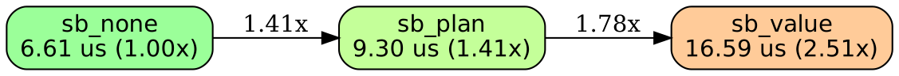

## swap_band/swap_band_n64 on macos-aarch64-c8-bare-apple

Run `20261116T185415Z-07a9e9a3`.

| variant | median | vs best |
|---|---|---|
| sb_none | 10.19 us | 1.00x |
| sb_plan | 12.50 us | 1.23x |
| sb_value | 17.98 us | 1.77x |

## swap_band/swap_band_n8192 on linux-x86_64-c16-bare-intel

Run `20261115T095526Z-266650fb-dirty`.

| variant | median | vs best |
|---|---|---|
| sb_none | 11.02 us | 1.00x |
| sb_plan | 13.92 us | 1.26x |
| sb_value | 5.17 ms | 468.55x |

## swap_band/swap_band_n8192 on macos-aarch64-c8-bare-apple

Run `20261116T185415Z-07a9e9a3`.

| variant | median | vs best |
|---|---|---|
| sb_none | 12.72 us | 1.00x |
| sb_plan | 15.11 us | 1.19x |
| sb_value | 2.56 ms | 201.29x |

## swap_column/swap_column_n1024 on linux-x86_64-c16-bare-intel

Run `20261115T100307Z-266650fb-dirty`.

| variant | median | vs best |
|---|---|---|
| cs_plain | 451.50 us | 1.00x |
| cs_exch | 707.51 us | 1.57x |
| cs_snap | 952.53 us | 2.11x |
| cs_snap_twin | 1.02 ms | 2.26x |

## swap_column/swap_column_n1024 on linux-x86_64-c4-container-intel

Run `20261113T190452Z-5e6887f-dirty`.

| variant | median | vs best |
|---|---|---|
| cs_plain | 584.76 us | 1.00x |
| cs_exch | 725.26 us | 1.24x |
| cs_snap_twin | 1.01 ms | 1.72x |
| cs_snap | 1.09 ms | 1.87x |

## swap_column/swap_column_n1024 on macos-aarch64-c8-bare-apple

Run `20261116T185638Z-07a9e9a3`.

| variant | median | vs best |
|---|---|---|
| cs_exch | 208.08 us | 1.00x |
| cs_plain | 209.30 us | 1.01x |
| cs_snap | 291.69 us | 1.40x |
| cs_snap_twin | 292.57 us | 1.41x |

## swap_column/swap_column_n64 on linux-x86_64-c16-bare-intel

Run `20261115T100024Z-266650fb`.

| variant | median | vs best |
|---|---|---|
| cs_plain | 16.47 us | 1.00x |
| cs_snap | 21.77 us | 1.32x |
| cs_snap_twin | 22.61 us | 1.37x |

## swap_column/swap_column_n64 on linux-x86_64-c4-container-intel

Run `20261113T190201Z-5e6887f-dirty`.

| variant | median | vs best |
|---|---|---|
| cs_plain | 22.78 us | 1.00x |
| cs_exch | 25.26 us | 1.11x |
| cs_snap_twin | 30.05 us | 1.32x |
| cs_snap | 49.87 us | 2.19x |

## swap_column/swap_column_n64 on macos-aarch64-c8-bare-apple

Run `20261116T185638Z-07a9e9a3`.

| variant | median | vs best |
|---|---|---|
| cs_exch | 21.35 us | 1.00x |
| cs_plain | 21.58 us | 1.01x |
| cs_snap | 26.90 us | 1.26x |
| cs_snap_twin | 26.93 us | 1.26x |

## swap_column/swap_column_n8192 on linux-x86_64-c16-bare-intel

Run `20261115T100719Z-266650fb-dirty`.

| variant | median | vs best |
|---|---|---|
| cs_plain | 6.29 ms | 1.00x |
| cs_exch | 7.15 ms | 1.14x |
| cs_snap | 9.09 ms | 1.45x |
| cs_snap_twin | 9.11 ms | 1.45x |

## swap_column/swap_column_n8192 on linux-x86_64-c4-container-intel

Run `20261113T190946Z-5e6887f-dirty`.

| variant | median | vs best |
|---|---|---|
| cs_plain | 10.16 ms | 1.00x |
| cs_exch | 11.54 ms | 1.14x |
| cs_snap_twin | 15.61 ms | 1.54x |
| cs_snap | 16.22 ms | 1.60x |

## swap_column/swap_column_n8192 on macos-aarch64-c8-bare-apple

Run `20261116T185638Z-07a9e9a3`.

| variant | median | vs best |
|---|---|---|
| cs_exch | 3.13 ms | 1.00x |
| cs_plain | 3.94 ms | 1.26x |
| cs_snap_twin | 4.37 ms | 1.39x |
| cs_snap | 4.50 ms | 1.44x |

## swap_cost/swap_cost_n64 on linux-x86_64-c16-bare-intel

Run `20261115T101140Z-266650fb-dirty`.

| variant | median | vs best |
|---|---|---|
| sc_v64b | 10 ns | 1.00x |
| sc_v1k | 16 ns | 1.62x |
| sc_v64k | 2.16 us | 213.46x |

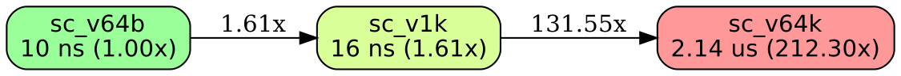

## swap_cost/swap_cost_n64 on macos-aarch64-c8-bare-apple

Run `20261116T185945Z-07a9e9a3`.

| variant | median | vs best |
|---|---|---|
| sc_v64b | 2 ns | 1.00x |
| sc_v1k | 70 ns | 40.94x |
| sc_v64k | 1.68 us | 985.41x |

## wake_policy/wake_policy_n1024 on linux-x86_64-c16-bare-intel

Run `20261115T102359Z-266650fb-dirty`.

| variant | median | vs best |
|---|---|---|
| wp_spin | 21.94 us | 1.00x |
| wp_nh8k | 24.03 us | 1.10x |
| wp_park | 24.76 us | 1.13x |
| wp_nh128 | 25.51 us | 1.16x |
| wp_isb8 | 27.39 us | 1.25x |
| wp_lp0 | 30.51 us | 1.39x |
| wp_nh2k | 41.44 us | 1.89x |

## wake_policy/wake_policy_n1024 on macos-aarch64-c8-bare-apple

Run `20261116T190104Z-07a9e9a3`.

| variant | median | vs best |
|---|---|---|
| wp_park | 8.61 us | 1.00x |
| wp_lp0 | 8.64 us | 1.00x |
| wp_isb8 | 9.01 us | 1.05x |
| wp_nh128 | 9.10 us | 1.06x |
| wp_nh2k | 12.30 us | 1.43x |
| wp_spin | 13.24 us | 1.54x |
| wp_nh8k | 17.57 us | 2.04x |

## wake_policy/wake_policy_n64 on linux-x86_64-c16-bare-intel

Run `20261115T101936Z-266650fb-dirty`.

| variant | median | vs best |
|---|---|---|
| wp_spin | 14.53 us | 1.00x |
| wp_park | 16.44 us | 1.13x |
| wp_nh8k | 17.19 us | 1.18x |
| wp_nh128 | 19.72 us | 1.36x |
| wp_lp0 | 23.89 us | 1.64x |
| wp_nh2k | 24.34 us | 1.67x |
| wp_isb8 | 30.45 us | 2.10x |

## wake_policy/wake_policy_n64 on macos-aarch64-c8-bare-apple

Run `20261116T190104Z-07a9e9a3`.

| variant | median | vs best |
|---|---|---|
| wp_lp0 | 5.04 us | 1.00x |
| wp_nh128 | 5.37 us | 1.07x |
| wp_park | 5.43 us | 1.08x |
| wp_isb8 | 5.56 us | 1.10x |
| wp_nh2k | 9.00 us | 1.79x |
| wp_spin | 9.74 us | 1.93x |
| wp_nh8k | 12.53 us | 2.49x |

## wake_policy/wake_policy_n8192 on linux-x86_64-c16-bare-intel

Run `20261115T102820Z-266650fb-dirty`.

| variant | median | vs best |
|---|---|---|
| wp_spin | 56.73 us | 1.00x |
| wp_isb8 | 59.65 us | 1.05x |
| wp_park | 65.03 us | 1.15x |
| wp_nh128 | 67.90 us | 1.20x |
| wp_lp0 | 70.14 us | 1.24x |
| wp_nh8k | 70.17 us | 1.24x |
| wp_nh2k | 78.82 us | 1.39x |

## wake_policy/wake_policy_n8192 on macos-aarch64-c8-bare-apple

Run `20261116T190104Z-07a9e9a3`.

| variant | median | vs best |
|---|---|---|
| wp_spin | 33.07 us | 1.00x |
| wp_nh2k | 34.06 us | 1.03x |
| wp_nh128 | 34.34 us | 1.04x |
| wp_park | 34.40 us | 1.04x |
| wp_isb8 | 34.56 us | 1.05x |
| wp_lp0 | 34.60 us | 1.05x |
| wp_nh8k | 51.65 us | 1.56x |

